# Chapter 10. Supabase Database CRUD — A회차: 강의

> **미션**: 공감터의 마음톡 글을 생성, 조회, 수정, 삭제할 수 있다

---

## 바이브코딩 원칙 (이번 장)

이번 장의 바이브코딩은 “**데이터 모델(테이블/컬럼)과 화면 요구사항(UI/상태)**을 동시에 명시해서, Copilot이 CRUD를 ‘대충’ 만들지 못하게 하는 것”이 핵심이다.

1. **테이블/컬럼을 정확히**: `mindtalk_posts`(또는 `board_posts`)의 컬럼명, 타입, 관계(예: `user_id`)를 프롬프트에 그대로 넣는다.
2. **CRUD를 화면 단위로 쪼갠다**: 목록(Read) → 상세(Read) → 작성(Create) → 수정(Update) → 삭제(Delete) 순으로 단계화한다.
3. **쿼리 조건을 말로 고정**: 정렬(예: 최신순), 필터(예: 내 글만), 페이지네이션 방식(limit/offset 등)을 명시한다.
4. **에러/로딩/빈 상태를 필수로**: 성공 케이스만 만들면 UX가 망가진다. 상태 UI 요구사항을 포함한다.
5. **검증 쿼리 + 로그**: “작동함”이 아니라, 어떤 입력으로 어떤 SQL/요청이 나가고 어떤 결과가 와야 하는지로 확인한다.

---

## Copilot 프롬프트 (복사/붙여넣기)

```text
너는 GitHub Copilot Chat이고, 내 Next.js(App Router) + Supabase 프로젝트의 CRUD 구현 파트너야.
목표: 게시글 CRUD를 UI까지 포함해 완성한다(로딩/에러/빈 상태 포함).

[데이터 모델]
- 테이블: `mindtalk_posts` (필요 시 `mindtalk_comments`)
- 컬럼 예: id uuid PK, user_id uuid FK→public.users, title text, content text, is_private boolean, created_at timestamptz
- 정렬 기본값: (예: created_at desc)

[화면/기능 요구사항]
1) 목록(`/mindtalk`): 최신순, 로딩 스켈레톤, 빈 상태 메시지
2) 상세(`/mindtalk/[id]`): 게시글 1개 조회, 없는 글 404 처리
3) 작성(`/mindtalk/new`): 폼 + 저장 후 상세로 이동
4) 수정: 작성자만 가능(UX상 버튼 숨김은 가능하지만 보안은 Ch11에서 RLS로 강제)
5) 삭제: 확인 다이얼로그 + 성공 후 목록으로 이동

[요구 출력]
- 단계별 구현 순서(최대 5단계)와 각 단계의 파일 변경 범위
- 각 단계에서 사용할 Supabase 쿼리 예시(select/insert/update/delete)
- 에러 메시지/토스트 문구 초안(사용자 친화적으로)

주의: 테이블/컬럼명은 임의로 바꾸지 말고, 애매하면 질문해줘.
```

## 전체 워크플로

```mermaid
graph LR
  A["① SQL CRUD<br/>기본 문법"] --> B["② Supabase<br/>클라이언트 CRUD"]
  B --> C["③ 쿼리 심화<br/>(필터·정렬·페이지)"]
  C --> D["④ React 연결<br/>(목록·작성·수정·삭제)"]
  D --> E["⑤ 컨텍스트<br/>업데이트"]

  style A fill:#E8F5E9,stroke:#2E7D32
  style B fill:#E8F5E9,stroke:#2E7D32
  style C fill:#E8F5E9,stroke:#2E7D32
  style D fill:#E8F5E9,stroke:#2E7D32
  style E fill:#E8F5E9,stroke:#2E7D32
```



**표 10.1** 실행 단계 요약

| 단계 | 내용                                                   | 실행 |  절  |
| :--: | ------------------------------------------------------ | :--: | :--: |
|  ①   | SQL CRUD 4대 명령 이해                                 |  🖱️  | 10.1 |
|  ②   | Supabase 클라이언트 CRUD (select/insert/update/delete) |  🤖  | 10.2 |
|  ③   | 필터링 · 정렬 · 페이지네이션 · 관계 데이터             |  🤖  | 10.3 |
|  ④   | React 컴포넌트에 CRUD 연결                             |  🤖  | 10.4 |
|  ⑤   | context.md 업데이트                                    |  🤖  | 10.5 |

> 🖱️ = 사람이 직접 실행 (SQL Editor에서 확인) · 🤖 = 바이브코딩 (Copilot)

---

## 학습목표

1. SELECT, INSERT, UPDATE, DELETE 기본 SQL 문법을 읽을 수 있다
2. Supabase JavaScript 클라이언트로 CRUD 작업을 수행할 수 있다
3. 필터링, 정렬, 페이지네이션을 구현할 수 있다
4. React 컴포넌트에서 Supabase CRUD를 연결할 수 있다
5. 관계 데이터(작성자 정보)를 한 번에 조회할 수 있다

---

## 수업 타임라인

**표 10.2** A회차 수업 타임라인

| 시간        | 내용                                               |
| ----------- | -------------------------------------------------- |
| 00:00~00:05 | 오늘의 미션 + 빠른 진단                            |
| 00:05~00:30 | SQL CRUD 기본 + Supabase 클라이언트 CRUD           |
| 00:30~00:55 | 쿼리 심화: 필터링, 정렬, 페이지네이션, 관계 데이터 |
| 00:55~01:20 | 라이브 코딩: React와 CRUD 연결                     |
| 01:20~01:27 | 핵심 정리 + B회차 과제 스펙 공개                   |
| 01:27~01:30 | Exit ticket                                        |

---

## 오늘의 미션 + 빠른 진단

> **오늘의 질문**: "공감터의 마음톡 글을 '만들고, 보고, 고치고, 지우는' 4가지 작업을 데이터베이스에서는 어떻게 처리하는가?"

**빠른 진단** (1문항):

다음 중 데이터를 "삭제"하는 SQL 명령은?

- (A) `SELECT`
- (B) `INSERT`
- (C) `DELETE`

정답: (C) — CRUD의 Delete에 해당한다.

---

## 10.1 SQL CRUD 기본 `🖱️ SQL Editor에서 확인`

> **라이브 코딩**: Supabase SQL Editor에서 아래 SQL을 하나씩 실행하며 결과를 확인한다

> **원리 — SQL CRUD 4대 명령**
>
> | SQL      | 작업 | 영문   | 예시             |
> | -------- | ---- | ------ | ---------------- |
> | `SELECT` | 조회 | Read   | 마음톡 목록 보기 |
> | `INSERT` | 생성 | Create | 새 마음톡 작성   |
> | `UPDATE` | 수정 | Update | 마음톡 제목 변경 |
> | `DELETE` | 삭제 | Delete | 마음톡 삭제      |
>
> 이 SQL을 직접 타이핑할 일은 거의 없다. Supabase JS 클라이언트가 대신 생성하지만, **뒤에서 어떤 SQL이 실행되는지** 알아야 디버깅할 수 있다.

각 명령의 기본 형태:

```sql
-- 조회: 모든 마음톡 글 가져오기
SELECT * FROM mindtalk_posts;

-- 생성: 새 마음톡 글 추가
INSERT INTO mindtalk_posts (title, content, user_id)
VALUES ('첫 글', '안녕하세요', 'uuid-value');

-- 수정: 특정 마음톡 글 제목 변경
UPDATE mindtalk_posts SET title = '수정된 제목' WHERE id = 'uuid-post-id';

-- 삭제: 특정 마음톡 글 삭제
DELETE FROM mindtalk_posts WHERE id = 'uuid-post-id';
```

> **원리 — WHERE, ORDER BY, LIMIT**
>
> ```sql
> SELECT * FROM mindtalk_posts WHERE user_id = 'uuid-value';  -- 조건 필터
> SELECT * FROM mindtalk_posts ORDER BY created_at DESC;       -- 최신순 정렬
> SELECT * FROM mindtalk_posts LIMIT 10;                       -- 10개만
> ```
>
> Supabase JS 클라이언트에서는 `.eq()`, `.order()`, `.limit()`로 대응된다. SQL JOIN 대신 **관계 데이터 조회** 문법(10.3.3절)을 사용한다.

---

## 10.2 Supabase 클라이언트로 CRUD `🤖 바이브코딩`

SQL의 원리를 알았으니, 이제 JavaScript로 같은 작업을 한다. Supabase 클라이언트는 SQL과 거의 1:1로 대응된다.

### 10.2.1 select: 데이터 조회 `🤖 바이브코딩`

> **Copilot 프롬프트**
> "Supabase 클라이언트로 mindtalk_posts 테이블의 모든 마음톡 글을 최신순으로 조회하는 코드를 만들어줘.
> @supabase/ssr의 createBrowserClient를 사용하고, 에러 처리도 포함해줘."

```javascript
import { createClient } from "@/lib/supabase/client";

const supabase = createClient();
// createClient()는 Ch8에서 만든 lib/supabase.ts의 래퍼 함수
// 내부적으로 @supabase/ssr의 createBrowserClient를 호출한다

// 모든 마음톡 글 조회 (최신순)
const { data: mindtalkPosts, error } = await supabase
  .from("mindtalk_posts")
  .select("*")
  .order("created_at", { ascending: false });

if (error) {
  console.error("조회 실패:", error.message);
} else {
  console.log("마음톡 글:", mindtalkPosts);
}
```

**표 10.4** SQL <> Supabase 클라이언트 대응

| SQL                            | Supabase 클라이언트                          | 설명                            |
| ------------------------------ | -------------------------------------------- | ------------------------------- |
| `SELECT * FROM mindtalk_posts` | `.from("mindtalk_posts").select("*")`        | mindtalk_posts 테이블의 모든 열 |
| `ORDER BY created_at DESC`     | `.order("created_at", { ascending: false })` | 최신순 정렬                     |
| `WHERE id = 1`                 | `.eq("id", 1)`                               | 조건 필터링                     |
| `LIMIT 10`                     | `.limit(10)`                                 | 개수 제한                       |

코드의 핵심 패턴: **모든 Supabase 쿼리는 `{ data, error }` 형태로 응답한다**. `data`에 결과가, `error`에 에러 정보가 담긴다. 둘 중 하나는 항상 `null`이다.

### 10.2.2 insert: 데이터 생성

```javascript
// 새 마음톡 글 생성
const { data, error } = await supabase
  .from("mindtalk_posts")
  .insert({
    title: "새 글 제목",
    content: "마음톡 내용입니다.",
    user_id: user.id, // 로그인한 사용자의 ID
  })
  .select(); // 생성된 데이터를 반환받으려면 .select() 추가
```

> `.select()`를 빼면 `data`가 `null`이 된다. 생성 후 바로 목록에 추가하려면 반드시 `.select()`를 체인한다.

### 10.2.3 update: 데이터 수정

```javascript
// 마음톡 글 수정
const { data, error } = await supabase
  .from("mindtalk_posts")
  .update({
    title: "수정된 제목",
    content: "수정된 내용",
  })
  .eq("id", postId) // 어떤 마음톡 글을 수정할지
  .select();
```

> **주의**: `.eq("id", postId)` 없이 `.update()`를 실행하면 **모든 행이 수정된다**. 반드시 조건을 지정한다.

### 10.2.4 delete: 데이터 삭제

```javascript
// 마음톡 글 삭제
const { error } = await supabase
  .from("mindtalk_posts")
  .delete()
  .eq("id", postId);
```

삭제에는 `.select()`가 필요 없다. 삭제된 데이터를 돌려받을 이유가 없기 때문이다.

**표 10.5** Supabase CRUD 요약

| 작업 | 메서드           | 조건 필요 | `.select()` 필요 |
| ---- | ---------------- | :-------: | :--------------: |
| 조회 | `.select()`      |   선택    |        --        |
| 생성 | `.insert({...})` |  불필요   |   결과 필요 시   |
| 수정 | `.update({...})` | **필수**  |   결과 필요 시   |
| 삭제 | `.delete()`      | **필수**  |      불필요      |

---

## 10.3 쿼리 심화 `🤖 바이브코딩`

기본 CRUD를 넘어서, 실제 서비스(예: 마음톡)에 필요한 심화 쿼리를 배운다.

### 10.3.1 필터링: eq, neq, gt, lt, like, ilike `🤖 바이브코딩`

Supabase 클라이언트는 다양한 **필터링**(Filtering) 메서드를 제공한다:

**표 10.6** Supabase 주요 필터 메서드

| 메서드             | SQL 대응    | 의미                      | 예시                        |
| ------------------ | ----------- | ------------------------- | --------------------------- |
| `.eq(col, val)`    | `= val`     | 같다                      | `.eq("id", 1)`              |
| `.ilike(col, pat)` | `ILIKE pat` | 패턴 매칭 (대소문자 무시) | `.ilike("title", "%next%")` |

> 그 외 `.neq`(같지 않다), `.gt`(크다), `.lt`(작다), `.like`(대소문자 구분 패턴 매칭) 등도 있다. 필요할 때 [Supabase 공식 문서](https://supabase.com/docs/reference/javascript/using-filters)를 참고한다.

> **나쁜 프롬프트**
> "게시글 검색 기능 만들어줘"

이 프롬프트로는 어떤 필드를 검색할지, 대소문자를 구분할지, 정렬은 어떻게 할지 AI가 알 수 없다.

> **Copilot 프롬프트**
> "Supabase에서 mindtalk_posts 테이블의 title과 content에서 키워드를 검색하는 함수를 만들어줘.
> ilike를 사용하고, 대소문자 무시, 결과는 최신순으로 정렬해줘."

### 10.3.2 정렬과 페이지네이션

게시글이 많아지면 한 번에 모두 불러오면 안 된다. **페이지네이션**(Pagination)으로 나누어 가져온다:

```javascript
// 페이지네이션: 페이지당 10개
const PAGE_SIZE = 10;
const page = 1; // 현재 페이지 (1부터 시작)

const {
  data: posts,
  error,
  count,
} = await supabase
  .from("mindtalk_posts")
  .select("*", { count: "exact" }) // 전체 개수도 함께 조회
  .order("created_at", { ascending: false })
  .range((page - 1) * PAGE_SIZE, page * PAGE_SIZE - 1);

// count로 전체 페이지 수 계산
const totalPages = Math.ceil(count / PAGE_SIZE);
```

**코드 읽기 가이드**:

**표 10.7** 페이지네이션 코드 해석

| 코드                     | 의미                                        |
| ------------------------ | ------------------------------------------- |
| `{ count: "exact" }`     | 전체 게시글 수를 정확하게 세기              |
| `.range(start, end)`     | start번째부터 end번째까지 가져오기 (0 기반) |
| `(page - 1) * PAGE_SIZE` | 1페이지: 0, 2페이지: 10, 3페이지: 20        |
| `page * PAGE_SIZE - 1`   | 1페이지: 9, 2페이지: 19, 3페이지: 29        |

### 10.3.3 관계 데이터 조회

마음톡 목록에 작성자 이름을 표시하려면 `users` 테이블의 데이터가 필요하다. Supabase는 JOIN 대신 **외래 키**(Foreign Key)를 따라가는 문법을 제공한다:

```javascript
// 마음톡 글 + 작성자 정보 함께 조회
const { data: posts, error } = await supabase
  .from("mindtalk_posts")
  .select(
    `
    *,
    users (
      name,
      role
    )
  `,
  )
  .order("created_at", { ascending: false });
```

결과 데이터 형태:

```json
[
  {
    "id": 1,
    "title": "첫 글",
    "content": "안녕하세요",
    "user_id": "uuid-123",
    "created_at": "2026-03-01T10:00:00",
    "users": {
      "name": "홍길동",
      "role": "user"
    }
  }
]
```

`mindtalk_posts.user_id -> users.id` 외래 키 관계를 Supabase가 자동으로 인식하여, `users` 안에 작성자 정보가 중첩된다.

> **핵심**: `.select("*, users(name, role)")`는 "mindtalk_posts의 모든 열과, 연결된 users의 name과 role을 가져와라"라는 뜻이다. SQL의 JOIN과 같은 결과이지만 문법이 훨씬 간결하다.

---

## 10.4 React와 CRUD 연결 `🤖 바이브코딩`

이제 Supabase CRUD를 React 컴포넌트에 연결한다.

### 10.4.1 게시글 목록 조회 `🤖 바이브코딩`

> **Copilot 프롬프트**
> "Next.js App Router에서 Supabase mindtalk_posts 테이블의 마음톡 글 목록을 표시하는 컴포넌트를 만들어줘.
> 작성자 이름도 함께 표시하고, 최신순으로 정렬해줘.
> useEffect와 useState를 사용하는 클라이언트 컴포넌트로 만들어줘."

> **함께 진행**: MindtalkList 컴포넌트를 함께 만들며 Supabase 쿼리가 React에서 어떻게 연결되는지 확인한다

```tsx
// components/mindtalk-list.tsx
"use client";

import { useEffect, useState } from "react";
import { createClient } from "@/lib/supabase/client";

export default function MindtalkList() {
  const [posts, setPosts] = useState([]);
  const [loading, setLoading] = useState(true);

  useEffect(() => {
    async function fetchPosts() {
      const supabase = createClient();
      const { data, error } = await supabase
        .from("mindtalk_posts")
        .select("*, users(name)")
        .order("created_at", { ascending: false });

      if (!error) setPosts(data);
      setLoading(false);
    }
    fetchPosts();
  }, []);

  if (loading) return <p>로딩 중...</p>;
  if (posts.length === 0) return <p>마음톡 글이 없습니다.</p>;

  return (
    <div className="space-y-4">
      {posts.map((post) => (
        <div key={post.id} className="border rounded-lg p-4">
          <h2 className="text-xl font-bold">{post.title}</h2>
          <p className="text-muted-foreground text-sm">
            {post.users?.name} ·{" "}
            {new Date(post.created_at).toLocaleDateString()}
          </p>
          <p className="mt-2">{post.content}</p>
        </div>
      ))}
    </div>
  );
}
```

**코드 읽기 가이드**:

- `useState([])` -- 게시글 배열, 초기값 빈 배열
- `useState(true)` -- 처음에는 로딩 상태
- `select("*, users(name)")` -- 마음톡 글 + 작성자 이름
- `post.users?.name` -- `?.`(**옵셔널 체이닝**, Optional Chaining)으로 users가 없어도 에러 방지

### 10.4.2 게시글 작성 폼

> **Copilot 프롬프트**
> "Supabase에 마음톡 글을 작성하는 React 폼 컴포넌트를 만들어줘.
> title과 content 입력 필드가 있고, 제출 시 mindtalk_posts 테이블에 insert해줘.
> 로그인한 사용자의 ID를 user_id로 넣어줘.
> useAuth Hook에서 user를 가져올 수 있어."

```tsx
// components/mindtalk-form.tsx
"use client";

import { useState } from "react";
import { createClient } from "@/lib/supabase/client";
import { useAuth } from "@/lib/auth-context";
import { useRouter } from "next/navigation";

export default function MindtalkForm() {
  const { user } = useAuth();
  const router = useRouter();
  const [title, setTitle] = useState("");
  const [content, setContent] = useState("");
  const [loading, setLoading] = useState(false);

  async function handleSubmit(e) {
    e.preventDefault();
    if (!title.trim() || !content.trim()) return;

    setLoading(true);
    const supabase = createClient();
    const { error } = await supabase.from("mindtalk_posts").insert({
      title: title.trim(),
      content: content.trim(),
      user_id: user.id,
    });

    if (error) {
      alert("작성 실패: " + error.message);
    } else {
      router.push("/mindtalk"); // 목록으로 이동
    }
    setLoading(false);
  }

  return (
    <form onSubmit={handleSubmit} className="space-y-4 max-w-2xl">
      <input
        type="text"
        placeholder="제목"
        value={title}
        onChange={(e) => setTitle(e.target.value)}
        className="w-full p-3 border rounded-lg"
        required
      />
      <textarea
        placeholder="내용을 입력하세요"
        value={content}
        onChange={(e) => setContent(e.target.value)}
        className="w-full p-3 border rounded-lg h-40"
        required
      />
      <button
        type="submit"
        disabled={loading}
        className="px-6 py-3 bg-primary text-primary-foreground rounded-lg hover:bg-primary/90 disabled:opacity-50"
      >
        {loading ? "작성 중..." : "게시글 작성"}
      </button>
    </form>
  );
}
```

### 10.4.3 게시글 수정/삭제

```typescript
// lib/mindtalk.ts — 마음톡 관련 함수 모음
import { createClient } from "@/lib/supabase/client";

export async function updateMindtalkPost(postId, { title, content }) {
  const supabase = createClient();
  const { data, error } = await supabase
    .from("mindtalk_posts")
    .update({ title, content })
    .eq("id", postId)
    .select();
  return { data, error };
}

export async function deleteMindtalkPost(postId) {
  const supabase = createClient();
  const { error } = await supabase
    .from("mindtalk_posts")
    .delete()
    .eq("id", postId);
  return { error };
}
```

삭제 버튼을 구현할 때는 **확인 대화상자**를 반드시 넣는다:

```jsx
// 삭제 버튼 예시
<button
  onClick={async () => {
    if (!confirm("정말 삭제하시겠습니까?")) return;
    const { error } = await deleteMindtalkPost(post.id);
    if (!error) router.refresh();
  }}
  className="text-destructive hover:text-destructive/80"
>
  삭제
</button>
```

### 10.4.4 작성자 정보 표시

게시글 상세 페이지에서 작성자 정보를 표시하고, **본인 글일 때만 수정/삭제 버튼**을 보여준다:

```jsx
// 조건부 렌더링: 본인 글인지 확인
{
  user && user.id === post.user_id && (
    <div className="flex gap-2">
      <button onClick={() => router.push(`/mindtalk/${post.id}`)}>상세</button>
      <button onClick={() => handleDelete(post.id)}>삭제</button>
    </div>
  );
}
```

> 이 조건부 렌더링은 **UI만 숨기는 것**이다. 실제 보안은 Ch11의 **RLS(Row Level Security)**가 담당한다. 개발자 도구에서 직접 API를 호출하면 이 UI 제한은 무시할 수 있다. 반드시 서버 레벨 보안(RLS)이 필요하다.

_전체 프로젝트는 practice/chapter10/ 참고_

---

## 10.5 컨텍스트 업데이트 `🤖 바이브코딩`

CRUD는 여러 컴포넌트에 걸쳐 구현된다. "어떤 컴포넌트에서 어떤 Supabase 메서드를 쓰는지"를 context.md에 기록하면, 다음 세션에서 Copilot이 기존 패턴에 맞춰 새 기능을 추가할 수 있다.

**세션 시작 프롬프트** — Ch10 작업을 시작할 때:

```text
#file:context.md #file:todo.md #file:ARCHITECTURE.md

Ch10 CRUD 구현을 시작하려고 해.
context.md에서 인증/DB 설정 상태를 확인하고,
todo.md에서 마음톡 CRUD 관련 할 일을 찾아줘.
Supabase 클라이언트 패턴은 기존 코드와 일관되게 해줘.
```

**이 장에서 context.md에 추가할 내용**:

```markdown
## 기술 결정 사항 (Ch10 추가)

- CRUD 패턴: Supabase .from().select/insert/update/delete + { data, error } 응답
- 컴포넌트 구조: MindtalkList (목록), MindtalkDetail (상세), MindtalkForm (작성/수정)
- 관계 조회: .select("\*, profiles(username, avatar_url)") 패턴
- 페이지네이션: .range(from, to) 방식

## 해결된 이슈 (Ch10)

- insert 후 목록 갱신 안 됨 → router.push() 또는 revalidatePath() 사용
- 작성자 정보 미표시 → profiles 테이블 JOIN 쿼리 추가

## 알게 된 점 (Ch10)

- UI에서 버튼을 숨기는 것은 보안이 아니다 → Ch11 RLS가 진짜 보안
- .eq("user_id", userId)로 작성자 필터링 가능
```

**세션 종료 프롬프트** — 작업을 마칠 때:

```text
Ch10 CRUD 구현을 마무리하려고 해.
context.md를 업데이트해줘:
- 기술 결정 사항: CRUD 패턴, 컴포넌트 구조, 관계 조회 방식
- 해결된 이슈: 데이터 갱신, 관계 쿼리 등
- 알게 된 점: 보안 관련 주의사항
todo.md에서 "마음톡 목록/상세/작성(CRUD)" 항목을 체크하고 진행률을 갱신해줘.
```

---

## 핵심 정리 + B회차 과제 스펙

### 이번 시간 핵심 3가지

1. **SQL CRUD 4대 명령**: `SELECT`(조회), `INSERT`(생성), `UPDATE`(수정), `DELETE`(삭제)
2. **Supabase 클라이언트는 SQL과 1:1 대응**: `.from().select()`, `.insert()`, `.update()`, `.delete()` — 모든 응답은 `{ data, error }`
3. **관계 데이터 조회**: `.select("*, profiles(username)")` — JOIN 대신 외래 키 기반 문법

### B회차 과제 스펙

**마음톡 CRUD 완성 + 배포**:

1. 게시글 목록 페이지 — 작성자 이름 표시, 최신순 정렬
2. 게시글 작성 페이지 — 로그인 사용자만 접근
3. 마음톡 상세 페이지 — 본인 글에만 수정/삭제 버튼
4. 마음톡 수정 기능
5. 마음톡 삭제 기능 — 확인 대화상자 포함
6. GitHub push + Vercel 배포

**스타터 코드**: `practice/chapter10/starter/` — 마음톡 프론트엔드(인증 포함)가 준비되어 있고, CRUD 함수 부분이 TODO로 비어 있다.

---

## Exit ticket

다음 코드에서 위험한 부분을 찾아라:

```javascript
await supabase.from("mindtalk_posts").update({ title: "수정된 제목" });
```

정답: `.eq("id", postId)`가 없어서 **mindtalk_posts 테이블의 모든 행의 제목이 수정된다**. update/delete에는 반드시 조건을 지정해야 한다.

---

## 현재 상태

- 마지막 작업일: 2026-02-26
- 완료된 작업: 2026년 기준 교육 자료 업데이트 및 동기화 (Next.js 16, Tailwind v4 준수)
- 작업자: Bive AI (GitHub Copilot)

---

## 학습 체크리스트

**수업 전 준비**:

- [ ] Supabase 대시보드에 테스트용 마음톡 글 2~3개 미리 입력
- [ ] SQL 4대 명령 (SELECT/INSERT/UPDATE/DELETE) 복습

**자기 점검**:

- [ ] SQL CRUD 4대 명령의 의미를 구분할 수 있는가
- [ ] Supabase 클라이언트 `.from().select()` 패턴을 이해했는가
- [ ] `{ data, error }` 응답 패턴과 에러 처리의 중요성을 인식했는가
- [ ] "UI에서 숨기기 != 보안"이라는 포인트를 이해했는가
- [ ] 세션 종료 시 context.md에 CRUD 패턴과 컴포넌트 구조를 기록했는가
