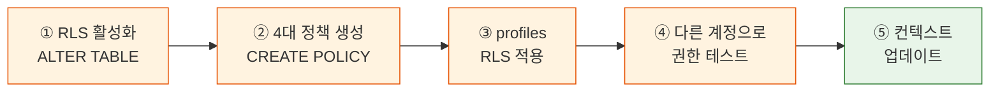

# Chapter 11. Row Level Security (RLS) — A회차: 강의

> **미션**: 공감터의 마음톡/게시판에서 “작성자만 수정·삭제”를 데이터베이스(RLS)가 강제한다

---

## 바이브코딩 원칙 (이번 장)

이번 장의 바이브코딩은 “**보안 규칙을 자연어로 먼저 고정**하고, Copilot이 그 규칙을 SQL 정책(RLS)로 정확히 번역하게 만드는 것”이다. 클라이언트에서 버튼을 숨기는 건 UX일 뿐, 보안이 아니다.

1. **권한 시나리오를 문장으로 쓴다**: “누구나 읽기 / 로그인 사용자만 작성 / 작성자만 수정·삭제”처럼 규칙을 먼저 확정한다.
2. **RLS 키워드를 강제한다**: `ALTER TABLE ... ENABLE ROW LEVEL SECURITY`, `CREATE POLICY`, `USING`, `WITH CHECK`, `auth.uid()`를 프롬프트에 포함한다.
3. **테이블 단위로 적용한다**: `mindtalk_posts`, `mindtalk_comments`, `reservations` 등 테이블별로 정책을 분리해 설명/적용한다.
4. **검증은 ‘우회 시도’로 한다**: 비로그인/다른 유저 세션으로 insert/update/delete를 시도해 “실패해야 정상”인 케이스를 포함한다.
5. **에러 메시지를 UX로 연결**: RLS 에러를 사용자가 이해할 문장으로 바꾸는 흐름(Ch12)까지 염두에 둔다.

---

## Copilot 프롬프트 (복사/붙여넣기)

```text
너는 GitHub Copilot Chat이고, Supabase(PostgreSQL) RLS 설계를 도와주는 보안 파트너야.
목표: `mindtalk_posts`(필요 시 `mindtalk_comments`/`reservations`)에 RLS를 켜고, 아래 권한 시나리오를 정책으로 강제한다.

[권한 시나리오] (예: 마음톡)
- SELECT: 공개글은 누구나, 비공개글은 작성자/상담사/관리자만
- INSERT: 로그인 사용자만 가능
- UPDATE: 작성자(user_id = auth.uid())만 가능
- DELETE: 작성자(user_id = auth.uid())만 가능

[테이블 스키마]
- mindtalk_posts 컬럼 예: id uuid, user_id uuid, title text, content text, is_private boolean, created_at timestamptz
- user_id는 `public.users(id)`(→ auth.users) 경로를 따른다

[요구 출력]
1) SQL 전체 스크립트: RLS 활성화 + 정책 4개(SELECT/INSERT/UPDATE/DELETE)
2) USING vs WITH CHECK를 왜 그렇게 썼는지 한 줄 설명씩
3) 테스트 시나리오 6개(성공 3, 실패 3)와 기대 결과

주의: 클라이언트 코드에서 if문으로 ‘보안 구현’하는 답은 금지. 반드시 DB 정책으로 강제해줘.
```

## 전체 워크플로



**표 11.1** 실행 단계 요약

| 단계 | 내용                                       | 실행  |   절   |
| :--: | ------------------------------------------ | :---: | :----: |
|  ①   | posts 테이블 RLS 활성화                    |  🖱️   |  11.3  |
|  ②   | 4대 정책(SELECT/INSERT/UPDATE/DELETE) 생성 | 🤖→🖱️ |  11.3  |
|  ③   | profiles 테이블 RLS 적용                   | 🤖→🖱️ | 11.4.5 |
|  ④   | 다른 계정으로 테스트 (우회 시도)           |  🖱️   |  11.4  |
|  ⑤   | context.md 업데이트                        |  🤖   |  11.5  |

> 🖱️ = 사람이 직접 실행 (SQL Editor) · 🤖→🖱️ = Copilot이 SQL 생성 → SQL Editor에서 직접 실행 · 🤖 = 바이브코딩

---

## 학습목표

1. 클라이언트 사이드 보안의 한계를 구체적으로 설명할 수 있다
2. RLS의 개념과 CREATE POLICY 문법을 이해할 수 있다
3. USING과 WITH CHECK의 차이를 구분할 수 있다
4. 게시판에 "누구나 읽기, 로그인 사용자만 작성, 작성자만 수정/삭제" 정책을 구현할 수 있다
5. RLS 정책을 테스트하고 디버깅할 수 있다

---

## 수업 타임라인

**표 11.2** A회차 수업 타임라인

| 시간        | 내용                                                        |
| ----------- | ----------------------------------------------------------- |
| 00:00~00:05 | 오늘의 미션 + 빠른 진단                                     |
| 00:05~00:30 | RLS의 필요성 + 기본 문법 (CREATE POLICY, USING, WITH CHECK) |
| 00:30~00:55 | 라이브 코딩: 4대 권한 시나리오 구현                         |
| 00:55~01:20 | RLS 테스트와 디버깅 + 트러블슈팅                            |
| 01:20~01:27 | 핵심 정리 + B회차 과제 스펙 공개                            |
| 01:27~01:30 | Exit ticket                                                 |

---

## 오늘의 미션 + 빠른 진단

> **오늘의 질문**: "Ch10에서 만든 게시판에서, 브라우저 콘솔에 코드를 입력하면 다른 사람의 게시글을 삭제할 수 있다. 이걸 어떻게 막는가?"

**빠른 진단** (1문항):

다음 중 "진짜 보안"에 해당하는 것은?

- (A) React에서 `if (user.id === post.user_id)` 조건으로 삭제 버튼을 숨김
- (B) 데이터베이스가 `auth.uid() = user_id`인 행만 삭제를 허용함
- (C) CSS로 삭제 버튼을 `display: none`으로 숨김

정답: (B) -- 데이터베이스 레벨에서 권한을 강제하는 것만이 진짜 보안이다.

---

> **원리 — 클라이언트 보안의 한계**
>
> Ch10에서 "본인 글에만 수정/삭제 버튼 표시"를 구현했지만, 이것은 **UI를 숨긴 것**이지 보안이 아니다. 브라우저 콘솔에서 `supabase.from("posts").delete().eq("id", 1)` 실행하면 다른 사람 글도 삭제된다.
>
> | 보안 위치              | 방법                                             |  우회 가능?   | 용도      |
> | ---------------------- | ------------------------------------------------ | :-----------: | --------- |
> | **클라이언트** (React) | `if (user.id === post.user_id)`                  | **쉽게 우회** | UX 개선   |
> | **서버** (RLS)         | `CREATE POLICY ... USING (auth.uid() = user_id)` | **우회 불가** | 실제 보안 |
>
> 핵심 원칙: **절대 클라이언트를 신뢰하지 마라**. RLS(Row Level Security)는 PostgreSQL이 **각 행에 대해 누가 무엇을 할 수 있는지** 강제한다.

> **원리 — CREATE POLICY 문법**
>
> ```sql
> ALTER TABLE posts ENABLE ROW LEVEL SECURITY;  -- ① RLS 활성화
> CREATE POLICY "정책이름" ON posts              -- ② 정책 생성
>   FOR SELECT USING (true);
> ```
>
> | SQL                    | 의미                                    |
> | ---------------------- | --------------------------------------- |
> | `CREATE POLICY "이름"` | 정책 이름 (한글 가능, 고유)             |
> | `ON posts`             | 적용 테이블                             |
> | `FOR SELECT`           | 적용 작업 (SELECT/INSERT/UPDATE/DELETE) |
> | `USING (true)`         | 조건: `true`면 모든 행 허용             |
>
> **중요**: RLS 활성화 시 정책이 없는 작업은 **모두 차단**. "모든 문이 잠기고, 정책은 열쇠를 꽂는 것".

> **원리 — USING vs WITH CHECK**
>
> | 조건         | 적용 시점                | 대상 작업              | 질문                                |
> | ------------ | ------------------------ | ---------------------- | ----------------------------------- |
> | `USING`      | **기존 행** 접근 시      | SELECT, UPDATE, DELETE | "이 행을 볼/수정/삭제할 수 있는가?" |
> | `WITH CHECK` | **새 행** 생성/수정 검증 | INSERT, UPDATE         | "이 행을 만들어도 되는가?"          |
>
> UPDATE는 둘 다 필요: `USING`→수정 가능 여부, `WITH CHECK`→수정 결과 유효성.
> `auth.uid()`는 JWT에서 현재 로그인 사용자 ID를 추출. 비로그인 시 `null`.

---

## 11.3 권한 시나리오 구현 `🤖→🖱️ SQL 생성 후 직접 실행`

게시판에 필요한 4가지 권한 시나리오를 SQL로 구현한다. Copilot이 SQL을 생성하고, **SQL Editor에서 직접 실행**한다.

> **Copilot 프롬프트**
> "Supabase에서 게시판 posts 테이블에 RLS 정책을 만들어줘.
>
> 1. 누구나 읽기 가능 (SELECT)
> 2. 로그인 사용자만 작성 (INSERT, user_id = auth.uid())
> 3. 작성자만 수정 (UPDATE, auth.uid() = user_id)
> 4. 작성자만 삭제 (DELETE, auth.uid() = user_id)
>    posts 테이블에 RLS를 먼저 활성화하고, 각 정책을 별도로 생성해줘."

비교를 위해 모호한 프롬프트도 보자:

> **나쁜 프롬프트**
> "게시판 보안 설정해줘"

이 프롬프트로는 AI가 클라이언트 코드에서 `if` 문으로 보안을 구현할 수 있다. "RLS", "CREATE POLICY", `auth.uid()` 같은 핵심 키워드가 없으면 Supabase 데이터베이스 레벨 보안이 아닌 프론트엔드 보안이 나올 가능성이 높다.

> **함께 진행**: SQL Editor를 열고, 아래 SQL을 순서대로 실행하자

### 11.3.1 "누구나 읽기 가능"

```sql
-- RLS 활성화
ALTER TABLE posts ENABLE ROW LEVEL SECURITY;

-- 정책: 누구나 읽기 가능
CREATE POLICY "누구나 게시글 읽기" ON posts
  FOR SELECT
  USING (true);
```

`USING (true)` -- 조건이 항상 참이므로 모든 행을 읽을 수 있다. 비로그인 사용자도 게시글 목록을 볼 수 있다.

### 11.3.2 "로그인 사용자만 작성"

```sql
CREATE POLICY "로그인 사용자만 작성" ON posts
  FOR INSERT
  WITH CHECK (auth.uid() = user_id);
```

`WITH CHECK (auth.uid() = user_id)` -- 새 게시글의 `user_id`가 현재 로그인한 사용자의 ID와 같아야만 INSERT가 허용된다. 이렇게 하면:

- 비로그인 사용자 -> 작성 불가 (`auth.uid()`가 `null`이므로 조건 불일치)
- 다른 사용자 ID로 작성 시도 -> 실패 (자신의 ID만 `user_id`에 넣을 수 있음)

### 11.3.3 "작성자만 수정/삭제"

```sql
-- 수정: 작성자만 가능
CREATE POLICY "작성자만 수정" ON posts
  FOR UPDATE
  USING (auth.uid() = user_id)
  WITH CHECK (auth.uid() = user_id);

-- 삭제: 작성자만 가능
CREATE POLICY "작성자만 삭제" ON posts
  FOR DELETE
  USING (auth.uid() = user_id);
```

UPDATE에는 `USING`과 `WITH CHECK`가 모두 필요하다:

- `USING` -- "이 행을 수정할 수 있는가?" (기존 데이터의 `user_id`가 나인가?)
- `WITH CHECK` -- "수정된 결과가 유효한가?" (`user_id`를 다른 사람으로 변경하는 것을 방지)

DELETE에는 `USING`만 필요하다. 삭제 후에 검증할 새 데이터가 없기 때문이다.

### 11.3.4 관리자/상담사 역할 기반 정책

게시판의 기본 4대 정책은 "작성자 본인"만 다루었다. 하지만 실제 서비스에서는 **관리자나 상담사가 다른 사용자의 데이터에 접근**해야 하는 경우가 있다. 예를 들어 상담 예약을 확인하고 상태를 변경하는 작업이다.

Ch8에서 `profiles` 테이블에 추가한 `role` 컬럼과 `EXISTS` 서브쿼리를 조합하면 역할 기반 정책을 만들 수 있다:

```sql
-- 관리자/상담사는 모든 예약 조회 가능
CREATE POLICY "관리자_모든_예약_조회" ON reservations
  FOR SELECT
  USING (
    auth.uid() = user_id
    OR EXISTS (
      SELECT 1 FROM profiles
      WHERE id = auth.uid() AND role IN ('counselor', 'admin')
    )
  );

-- 관리자/상담사는 예약 상태 변경 가능
CREATE POLICY "관리자_예약_상태_변경" ON reservations
  FOR UPDATE
  USING (
    EXISTS (
      SELECT 1 FROM profiles
      WHERE id = auth.uid() AND role IN ('counselor', 'admin')
    )
  );
```

**`EXISTS` 패턴 설명**: `EXISTS (SELECT 1 FROM profiles WHERE id = auth.uid() AND role IN (...))` 는 "현재 로그인한 사용자의 profiles 행을 찾아서, role이 counselor 또는 admin인지 확인"하는 서브쿼리이다. 조건이 참이면 정책을 통과한다.

SELECT 정책에서 `auth.uid() = user_id OR EXISTS(...)` 로 조합하면, **일반 사용자는 본인 예약만, 관리자는 전체 예약을 조회**할 수 있다. 이것이 Ch10에서 언급한 "역할에 따라 조회 범위가 달라지는" 원리이다.

**표 11.3** 게시판 RLS 정책 요약

| 정책 이름            | 작업   | 조건                                              | 설명                 |
| -------------------- | ------ | ------------------------------------------------- | -------------------- |
| 누구나 게시글 읽기   | SELECT | `true`                                            | 비로그인도 읽기 가능 |
| 로그인 사용자만 작성 | INSERT | `auth.uid() = user_id`                            | 본인 ID로만 작성     |
| 작성자만 수정        | UPDATE | `auth.uid() = user_id`                            | 본인 글만 수정       |
| 작성자만 삭제        | DELETE | `auth.uid() = user_id`                            | 본인 글만 삭제       |
| 관리자 모든 예약 조회 | SELECT | `user_id OR EXISTS(... role IN ('counselor','admin'))` | 본인+관리자 조회 |
| 관리자 예약 상태 변경 | UPDATE | `EXISTS(... role IN ('counselor','admin'))`        | 관리자만 상태 변경   |

---

## 11.4 RLS 테스트와 디버깅 `🖱️ 직접 실행`

정책을 작성했으면 반드시 **테스트**해야 한다. 정책이 올바르게 동작하는지 확인하지 않으면, 보안 구멍이 그대로 남거나 반대로 정상 기능이 차단될 수 있다.

> **팁**: "RLS를 적용하고 테스트 안 하는 것은, 현관문에 자물쇠를 달고 잠갔는지 확인 안 하는 것과 같다."

### 11.4.1 다른 사용자 계정으로 테스트

가장 확실한 테스트: **다른 계정으로 로그인**하여 다른 사람의 글을 수정/삭제 시도한다. 시크릿 창(Chrome: Ctrl+Shift+N, macOS: Cmd+Shift+N)에서 다른 계정으로 로그인한다.

**표 11.4** RLS 테스트 시나리오

|  #  | 시나리오                                | 예상 결과              |
| :-: | --------------------------------------- | ---------------------- |
|  1  | 비로그인 -> 게시글 목록 조회            | 성공 (누구나 읽기)     |
|  2  | 비로그인 -> 게시글 작성 시도            | 실패 (로그인 필요)     |
|  3  | 사용자 A -> 게시글 작성                 | 성공                   |
|  4  | 사용자 A -> 본인 글 수정                | 성공                   |
|  5  | 사용자 B -> 사용자 A의 글 수정 시도     | **실패** (작성자 아님) |
|  6  | 사용자 B -> 사용자 A의 글 삭제 시도     | **실패** (작성자 아님) |
|  7  | 관리자 -> 모든 예약 조회                | 성공 (관리자 역할)     |
|  8  | 일반 사용자 -> 다른 사용자 예약 조회    | **실패** (본인만 보임) |

> **함께 진행**: 두 개의 계정을 번갈아 사용하며 테스트해보자

### 11.4.2 RLS 거부 시 동작

**표 11.5** RLS 거부 시 동작

| 작업   | RLS 거부 시 동작        | 설명                                         |
| ------ | ----------------------- | -------------------------------------------- |
| SELECT | 해당 행이 결과에서 제외 | 에러 없이 빈 배열 또는 부분 결과 반환        |
| INSERT | `42501` 에러 반환       | `new row violates row-level security policy` |
| UPDATE | 영향 받은 행 0개        | 에러 없이 조용히 실패 (행이 안 보이므로)     |
| DELETE | 영향 받은 행 0개        | 에러 없이 조용히 실패 (행이 안 보이므로)     |

> RLS가 거부한 행은 "존재하지 않는 것"처럼 취급된다. SELECT에서는 단순히 결과에 포함되지 않고, UPDATE/DELETE에서는 아무 행도 영향받지 않는다. INSERT만 명시적 에러(`42501`)를 반환한다. 이는 보안상 의도적인 동작이다 -- 공격자에게 데이터 존재 여부를 알려주지 않는다.

### 11.4.3 흔한 RLS 트러블슈팅

**"갑자기 데이터가 안 보여요"** -- RLS를 활성화한 후 SELECT 정책을 깜빡하면 발생한다.

```sql
-- 해결: SELECT 정책 추가
CREATE POLICY "누구나 읽기" ON posts
  FOR SELECT USING (true);
```

**"게시글 작성이 안 돼요"** -- INSERT 정책의 `WITH CHECK` 조건을 확인한다. `user_id`를 클라이언트에서 직접 보내야 하는데, 코드에서 빠뜨렸을 수 있다.

```javascript
// ❌ user_id를 빠뜨림 → WITH CHECK 실패
await supabase.from("posts").insert({ title, content });

// ✅ user_id를 포함 → WITH CHECK 통과
await supabase.from("posts").insert({ title, content, user_id: user.id });
```

**"본인 글인데 수정이 안 돼요"** -- `posts.user_id`와 `auth.uid()`의 타입이 모두 `uuid`인지 확인한다. 타입이 다르면 비교가 항상 실패한다.

### 11.4.4 Ch10 코드와 RLS의 관계

좋은 소식: **Ch10에서 작성한 코드는 수정할 필요가 없다**. RLS는 데이터베이스 레벨에서 동작하므로, 클라이언트 코드는 이전과 동일하게 `.insert()`, `.update()`, `.delete()`를 호출한다. 차이점은 RLS가 요청을 허용하거나 거부한다는 것뿐이다.

```javascript
// Ch10에서 작성한 코드 — 변경 없이 그대로 사용
const { error } = await supabase.from("posts").delete().eq("id", postId);

// RLS 적용 전: 항상 성공
// RLS 적용 후: 본인 글만 성공, 다른 사람 글은 실패
```

### 11.4.5 profiles 테이블 RLS

posts만이 아니라 **profiles 테이블에도 RLS가 필요하다**:

```sql
-- profiles RLS 활성화
ALTER TABLE profiles ENABLE ROW LEVEL SECURITY;

-- 누구나 프로필 읽기 가능
CREATE POLICY "누구나 프로필 읽기" ON profiles
  FOR SELECT
  USING (true);

-- 본인 프로필만 수정 가능
CREATE POLICY "본인 프로필만 수정" ON profiles
  FOR UPDATE
  USING (auth.uid() = id)
  WITH CHECK (auth.uid() = id);
```

> **보안 참고 — role 자기 변경 방지**: `profiles`의 `role`은 기본값이 `'user'`이다. 관리자 역할(`'counselor'`, `'admin'`)은 Supabase Table Editor에서 직접 변경한다. 사용자가 본인의 `role`을 `'admin'`으로 변경하지 못하도록, 프론트엔드에서 role 변경 UI를 제공하지 않는다. 추가로, UPDATE 정책에서 `role` 컬럼 변경을 명시적으로 금지하려면 PostgreSQL의 컬럼 레벨 권한이나 트리거를 사용할 수 있지만, 이 교재 범위에서는 "UI 미제공 + RLS"로 충분하다.

---

## 11.5 컨텍스트 업데이트 `🤖 바이브코딩`

RLS 정책은 **SQL Editor에서 실행하고 나면 코드에 남지 않는다**. 어떤 테이블에 어떤 정책을 적용했는지 context.md에 기록하지 않으면, 다음 세션에서 Copilot이 중복 정책을 만들거나 누락된 정책을 놓칠 수 있다.

**세션 시작 프롬프트** — Ch11 작업을 시작할 때:

```text
#file:context.md #file:todo.md #file:ARCHITECTURE.md

Ch11 RLS 보안 정책을 시작하려고 해.
context.md에서 현재 테이블 구조와 CRUD 상태를 확인하고,
todo.md에서 보안 관련 할 일을 찾아줘.
어떤 테이블에 어떤 RLS 정책이 필요한지 정리해줘.
```

**이 장에서 context.md에 추가할 내용**:

```markdown
## 기술 결정 사항 (Ch11 추가)

- 보안: Supabase RLS (Row Level Security) — 모든 테이블에 활성화
- mindtalk_posts 정책:
  - SELECT: 누구나 읽기 가능
  - INSERT: 로그인 사용자만 (auth.uid() IS NOT NULL)
  - UPDATE/DELETE: 작성자만 (auth.uid() = user_id)
- profiles 정책:
  - SELECT: 누구나 읽기 가능
  - UPDATE: 본인만 수정 (auth.uid() = id)

## 해결된 이슈 (Ch11)

- RLS 활성화 후 데이터가 안 보임 → SELECT 정책을 먼저 만들어야 한다
- "new row violates RLS policy" 에러 → INSERT 정책의 WITH CHECK 조건 확인

## 알게 된 점 (Ch11)

- USING은 "기존 행 접근", WITH CHECK는 "새/수정 행 검증"
- auth.uid()는 Supabase가 JWT에서 자동 추출하는 현재 로그인 사용자 ID
```

**세션 종료 프롬프트** — 작업을 마칠 때:

```text
Ch11 RLS 작업을 마무리하려고 해.
context.md를 업데이트해줘:
- 기술 결정 사항: 각 테이블별 RLS 정책 목록
- 해결된 이슈: RLS 적용 중 겪은 에러와 해결법
- 알게 된 점: USING vs WITH CHECK, auth.uid() 등
todo.md에서 RLS 관련 항목을 체크하고 진행률을 갱신해줘.
```

> **팁**: RLS 정책은 Supabase 대시보드의 **Authentication → Policies**에서도 확인할 수 있다. context.md와 대시보드가 일치하는지 교차 확인하자.

---

## 핵심 정리 + B회차 과제 스펙

### 이번 시간 핵심 3가지

1. **클라이언트 보안은 보안이 아니다** -- 브라우저는 사용자가 완전히 제어 가능하므로, RLS로 데이터베이스가 보안을 강제한다
2. **RLS 4대 정책**: 누구나 읽기(SELECT), 로그인만 작성(INSERT), 작성자만 수정(UPDATE), 작성자만 삭제(DELETE)
3. **USING vs WITH CHECK**: USING은 "기존 행에 접근할 때", WITH CHECK는 "새 행을 만들거나 수정할 때"

### B회차 과제 스펙

**게시판 권한 정책 작성 + 검증 + 배포**:

1. posts 테이블 RLS 활성화 + 4대 정책 생성
2. profiles 테이블 RLS 적용
3. 다른 계정으로 수정/삭제 차단 테스트
4. GitHub push + Vercel 배포

**스타터 코드**: `practice/chapter11/starter/` -- Ch10 완성 코드 기반이며, `supabase/policies.sql`에 TODO로 정책 작성 가이드가 제공된다.

---

## Exit ticket

다음 RLS 정책에서 잘못된 부분을 찾아라:

```sql
CREATE POLICY "로그인 사용자만 작성" ON posts
  FOR INSERT
  USING (auth.uid() = user_id);
```

정답: INSERT에는 `USING`이 아니라 `WITH CHECK`를 사용해야 한다. INSERT는 새 행을 생성하는 것이므로 "기존 행 조건"인 USING이 아닌 "새 행 검증"인 WITH CHECK가 올바르다.

---

## 현재 상태

- 마지막 작업일: 2026-02-26
- 완료된 작업: 2026년 기준 교육 자료 업데이트 및 동기화 (Next.js 16, Tailwind v4 준수)
- 작업자: Bive AI (GitHub Copilot)

---

## 학습 체크리스트

**수업 전 준비**:

- [ ] 계정 2개 준비 (RLS 테스트용)
- [ ] SQL 정책 코드 준비 (SQL Editor에 복사-붙여넣기용)
- [ ] USING vs WITH CHECK 차이 복습

**자기 점검**:

- [ ] "클라이언트 보안 != 진짜 보안"을 이해했는가
- [ ] CREATE POLICY 문법을 읽을 수 있는가
- [ ] USING과 WITH CHECK의 차이를 구분할 수 있는가
- [ ] `auth.uid()` 함수의 역할을 이해했는가
- [ ] 세션 종료 시 context.md에 각 테이블의 RLS 정책을 기록했는가
