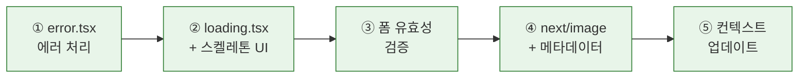

# Chapter 12. 에러 처리와 UX 완성 — A회차: 강의

> **미션**: 사용자가 불편함 없이 쓸 수 있는 앱으로 다듬는다

---

## 바이브코딩 원칙 (이번 장)

이번 장의 바이브코딩은 “**실패 케이스를 먼저 정의**하고, Copilot이 그 실패를 **사용자 경험(UX)**으로 번역하게 만드는 것”이다. 기능이 돌아가도 에러/로딩/빈 상태가 없으면 사용자는 “앱이 망가졌다”고 느낀다.

1. **에러를 분류해서 다룬다**: 네트워크/인증/권한/검증/서버 에러를 섞지 말고 각각 처리 방식을 정한다.
2. **사용자 메시지와 개발자 로그를 분리**: 화면에는 친절한 문장, 콘솔/로그에는 원인(에러 원문)을 남긴다.
3. **상태 UI를 요구사항으로 명시**: loading(스켈레톤), empty(비어 있음), error(재시도/안내) 3가지를 반드시 포함한다.
4. **재현 절차가 곧 프롬프트**: “어떻게 하면 에러가 나는지”를 Copilot에 그대로 전달하면 해결 속도가 빨라진다.
5. **수정은 최소 단위로**: 한 번에 전부 바꾸지 말고, (1) 화면 1개 (2) 동작 1개 (3) 상태 1개씩 고친다.

---

## Copilot 프롬프트 (복사/붙여넣기)

```text
너는 GitHub Copilot Chat이고, 내 Next.js(App Router) 프로젝트의 UX/에러처리 파트너야.
목표: 로딩/빈 상태/에러 처리를 추가해서 “흰 화면”을 없애고, 사용자가 문제를 이해하고 복구할 수 있게 만든다.

[현재 상황]
- 문제가 나는 화면/기능: (예: `/reservation/online` 예약 신청, `/mindtalk/new` 글쓰기, `/mypage/reservations` 조회)
- 재현 절차: (1) ___ (2) ___ (3) ___
- 실제로 보이는 증상: (예: 흰 화면, 콘솔 에러 ___)
- 기대 동작: (예: 토스트로 안내 + 재시도 버튼 + fallback UI)

[제약/스택]
- Next.js App Router 사용
- 신규 라이브러리 도입은 최소화(필요하면 이유를 설명하고 선택지 1~2개만)

[요구 출력]
1) 에러/로딩/빈 상태를 어디에 넣을지: `error.tsx`, `loading.tsx`, 컴포넌트 레벨 중 추천
2) 수정할 파일 목록(경로 포함) + 각 파일에서 무엇을 바꿀지
3) 사용자 메시지 문구 초안 5개(권한/네트워크/검증 포함)
4) 디버깅 체크리스트(콘솔/네트워크/응답 payload 기준)

주의: 사용자에게는 에러 코드를 그대로 보여주지 말고, 개발자 로그는 에러 원문을 남겨줘.
```

## 전체 워크플로



**표 12.1** 실행 단계 요약

| 단계 | 내용                          | 실행 |   절   |
| :--: | ----------------------------- | :--: | :----: |
|  ①   | error.tsx 에러 처리 페이지    |  🤖  | 12.2.2 |
|  ②   | loading.tsx + 스켈레톤 UI     |  🤖  |  12.3  |
|  ③   | 폼 유효성 검증 (클라이언트)   |  🤖  |  12.4  |
|  ④   | next/image + 메타데이터 (SEO) |  🤖  |  12.5  |
|  ⑤   | context.md 업데이트           |  🤖  |  12.6  |

> 🤖 = 바이브코딩 (Copilot) — 이번 장은 전부 코드 작업이므로 모두 Copilot으로 진행 가능

---

## 학습목표

1. 웹 애플리케이션에서 발생하는 에러 유형을 분류할 수 있다
2. try-catch와 Next.js error.tsx로 에러를 처리할 수 있다
3. Next.js loading.tsx와 스켈레톤 UI로 로딩 상태를 표시할 수 있다
4. 클라이언트 사이드 폼 유효성 검증을 구현할 수 있다
5. next/image로 이미지를 최적화하고 메타데이터를 설정할 수 있다

---

## 수업 타임라인

**표 12.2** A회차 수업 타임라인

| 시간        | 내용                                                                      |
| ----------- | ------------------------------------------------------------------------- |
| 00:00~00:05 | 오늘의 미션 + 빠른 진단                                                   |
| 00:05~00:30 | 에러의 종류 + 에러 처리 패턴                                              |
| 00:30~00:55 | 로딩 상태 관리 + 폼 유효성 검증                                           |
| 00:55~01:20 | 라이브 코딩: error.tsx + loading.tsx + 스켈레톤 UI + 폼 검증 + next/image |
| 01:20~01:27 | 핵심 정리 + B회차 과제 스펙 공개                                          |
| 01:27~01:30 | Exit ticket                                                               |

---

## 오늘의 미션 + 빠른 진단

> **오늘의 질문**: "게시판에서 인터넷이 끊기면 어떤 화면이 보여야 하는가? 흰 화면? 아니면 '인터넷 연결을 확인해주세요' 메시지?"

**빠른 진단** (1문항):

다음 중 사용자에게 보여주기에 가장 적절한 에러 메시지는?

- (A) `Error: 42501`
- (B) `RLS policy violation for table "posts"`
- (C) "이 게시글을 수정할 권한이 없습니다."

정답: (C) — 개발자용 에러 코드가 아닌, 사용자가 이해할 수 있는 메시지를 보여줘야 한다.

---

> **원리 — 에러 4종류**
>
> 좋은 앱은 에러를 분류하여 사용자에게 적절히 안내한다. 흰 화면은 절대 안 된다.
>
> | 에러 유형    | 코드/상태         | 사용자 메시지                      | 조치               |
> | ------------ | ----------------- | ---------------------------------- | ------------------ |
> | **네트워크** | `NETWORK_ERROR`   | "인터넷 연결을 확인해주세요"       | 재시도 버튼        |
> | **인증**     | `session_expired` | "로그인이 만료되었습니다"          | 로그인 페이지 이동 |
> | **권한**     | `42501` (RLS)     | "이 작업을 수행할 권한이 없습니다" | 이전 페이지 이동   |
> | **유효성**   | not-null 등       | "제목을 입력해주세요"              | 입력 필드 강조     |
>
> 핵심: 개발자에게는 `console.error(error)`, 사용자에게는 친절한 메시지. `42501` 같은 코드를 UI에 노출하면 안 된다.

---

## 12.2 에러 처리 패턴 `🤖 바이브코딩`

### 12.2.1 try-catch 구조화 `🤖 바이브코딩`

**try-catch**는 비동기 함수에서 에러를 처리하는 기본 패턴이다:

```javascript
// 에러 처리 유틸리티 함수
export async function fetchPosts() {
  try {
    const supabase = createClient();
    const { data, error } = await supabase
      .from("posts")
      .select("*, profiles(username)")
      .order("created_at", { ascending: false });

    if (error) throw error;
    return { data, error: null };
  } catch (error) {
    console.error("게시글 조회 실패:", error);
    return { data: null, error: getUserMessage(error) };
  }
}

// 에러 코드 → 사용자 메시지 변환
function getUserMessage(error) {
  if (error.code === "PGRST301") return "요청한 데이터를 찾을 수 없습니다.";
  if (error.code === "42501") return "이 작업을 수행할 권한이 없습니다.";
  if (error.message?.includes("Failed to fetch"))
    return "인터넷 연결을 확인해주세요.";
  return "일시적인 오류가 발생했습니다. 잠시 후 다시 시도해주세요.";
}
```

**표 12.3** try-catch 에러 처리 패턴

| 부분                     | 역할                                |
| ------------------------ | ----------------------------------- |
| `try { ... }`            | 에러가 발생할 수 있는 코드를 감싸기 |
| `if (error) throw error` | Supabase의 에러를 catch로 전달      |
| `catch (error) { ... }`  | 에러 발생 시 실행될 코드            |
| `console.error(...)`     | 개발자용 로그 (브라우저 콘솔)       |
| `getUserMessage(error)`  | 사용자용 메시지로 변환              |

> 왜 Supabase 에러를 다시 `throw`하는가? Supabase 클라이언트는 에러가 발생해도 예외를 던지지 않는다. `{ data: null, error: {...} }` 형태로 반환한다. `throw`로 에러를 catch 블록에 전달하면 네트워크 에러와 Supabase 에러를 **한 곳에서 통합 처리**할 수 있다.

### 12.2.2 Next.js error.tsx 활용 `🤖 바이브코딩`

Next.js App Router는 파일 기반 에러 처리를 제공한다. 폴더에 **error.tsx**(Error Boundary File)를 넣으면, 해당 폴더와 하위 경로에서 발생하는 에러를 자동으로 잡는다:

> **Copilot 프롬프트**
> "Next.js App Router에서 error.tsx를 사용한 에러 처리 컴포넌트를 만들어줘.
> 에러 메시지를 보여주고, '다시 시도' 버튼을 포함해줘.
> 'use client' 지시어를 붙여줘."

> **라이브 코딩**: error.tsx를 함께 만들고, 의도적으로 에러를 발생시켜 동작을 확인한다

```jsx
// app/error.tsx
"use client";

export default function Error({ error, reset }) {
  return (
    <div className="flex flex-col items-center justify-center min-h-[50vh] gap-4">
      <h2 className="text-2xl font-bold text-destructive">
        문제가 발생했습니다
      </h2>
      <p className="text-muted-foreground">
        {error.message || "일시적인 오류입니다."}
      </p>
      <button
        onClick={() => reset()}
        className="px-6 py-3 bg-primary text-primary-foreground rounded-lg hover:bg-primary/90"
      >
        다시 시도
      </button>
    </div>
  );
}
```

**표 12.4** error.tsx 컴포넌트의 props

| prop    | 타입     | 역할                                          |
| ------- | -------- | --------------------------------------------- |
| `error` | Error    | 발생한 에러 객체                              |
| `reset` | Function | 에러 상태를 초기화하고 컴포넌트를 다시 렌더링 |

> `error.tsx`는 반드시 **클라이언트 컴포넌트**(`"use client"`)여야 한다. 서버 컴포넌트에서 발생한 에러도 이 컴포넌트가 잡아준다.

> **보안 참고**: Next.js는 프로덕션 빌드에서 `error.message`의 내부 정보를 자동으로 제거하여 일반적인 메시지만 전달한다. 하지만 개발 모드에서는 상세 에러가 그대로 보이므로, `getUserMessage()` 같은 변환 함수를 사용하는 것이 더 안전하다.

### 12.2.3 사용자 친화적 에러 메시지

에러 메시지 작성의 3가지 원칙:

1. **무엇이 잘못되었는지** 알려준다 ("게시글을 불러올 수 없습니다")
2. **왜 발생했는지** 가능하면 설명한다 ("인터넷 연결이 불안정합니다")
3. **어떻게 해결할 수 있는지** 안내한다 ("다시 시도 버튼을 눌러주세요")

**표 12.5** 좋은 에러 메시지 vs 나쁜 에러 메시지

| 나쁜 메시지                    | 좋은 메시지                                                      |
| ------------------------------ | ---------------------------------------------------------------- |
| `Error: 42501`                 | "이 게시글을 수정할 권한이 없습니다."                            |
| `Failed to fetch`              | "인터넷 연결을 확인하고 다시 시도해주세요."                      |
| `null value in column "title"` | "제목을 입력해주세요."                                           |
| `Something went wrong`         | "게시글 저장 중 문제가 발생했습니다. 잠시 후 다시 시도해주세요." |

---

## 12.3 로딩 상태 관리 `🤖 바이브코딩`

데이터를 불러오는 동안 사용자에게 아무것도 보여주지 않으면, 앱이 멈춘 것처럼 느껴진다. 로딩 상태를 표시하면 "지금 처리 중"이라는 피드백을 준다.

### 12.3.1 Next.js loading.tsx 활용 `🤖 바이브코딩`

`error.tsx`처럼, **loading.tsx**(Loading UI File)를 폴더에 넣으면 해당 경로의 **서버 컴포넌트가 데이터를 가져오는 동안** 자동으로 표시된다:

```jsx
// app/loading.tsx
export default function Loading() {
  return (
    <div className="flex items-center justify-center min-h-[50vh]">
      <div className="animate-spin rounded-full h-12 w-12 border-b-2 border-primary" />
    </div>
  );
}
```

`animate-spin`은 Tailwind CSS가 제공하는 회전 애니메이션이다. 별도의 라이브러리 없이 스피너를 만들 수 있다.

> `loading.tsx`는 React Suspense를 내부적으로 사용한다. 이 파일이 있으면 Next.js가 자동으로 `<Suspense fallback={<Loading />}>`를 감싸준다.

### 12.3.2 스켈레톤 UI with Tailwind `🤖 바이브코딩`

**스켈레톤 UI**(Skeleton UI)는 콘텐츠가 로드되기 전에 **레이아웃의 뼈대**를 미리 보여주는 패턴이다. 빈 화면이나 스피너보다 사용자 경험이 좋다.

> **Copilot 프롬프트**
> "Tailwind CSS로 게시글 목록의 스켈레톤 UI를 만들어줘.
> 제목, 작성자, 날짜 자리에 회색 막대가 반짝이는(pulse) 애니메이션으로 표시해줘.
> 3개의 카드를 보여줘."

```jsx
// components/post-list-skeleton.tsx
export default function PostListSkeleton() {
  return (
    <div className="space-y-4">
      {[1, 2, 3].map((i) => (
        <div key={i} className="border rounded-lg p-4 animate-pulse">
          {/* 제목 자리 */}
          <div className="h-6 bg-muted rounded w-3/4 mb-2" />
          {/* 작성자 + 날짜 자리 */}
          <div className="h-4 bg-muted rounded w-1/3 mb-3" />
          {/* 내용 자리 */}
          <div className="space-y-2">
            <div className="h-4 bg-muted rounded w-full" />
            <div className="h-4 bg-muted rounded w-5/6" />
          </div>
        </div>
      ))}
    </div>
  );
}
```

**코드 읽기 가이드**:

- `animate-pulse` — Tailwind의 깜빡임 애니메이션 (로딩 중임을 표현)
- `h-6 bg-muted rounded w-3/4` — 높이 6, 회색 배경, 둥근 모서리, 너비 75%
- `[1, 2, 3].map(...)` — 3개의 카드 반복 (실제 데이터 대신 자리 표시)

스켈레톤 UI는 실제 콘텐츠와 **같은 레이아웃**이어야 한다. 데이터가 로드되면 스켈레톤이 실제 콘텐츠로 자연스럽게 교체된다.

**표 12.6** 로딩 표시 방법 비교

| 방법        | 장점                 | 단점                        | 권장 사용처            |
| ----------- | -------------------- | --------------------------- | ---------------------- |
| 빈 화면     | 구현 불필요          | 앱이 멈춘 것 같음           | 사용하지 않음          |
| 스피너      | 구현 간단            | 얼마나 기다려야 하는지 모름 | 짧은 작업 (저장, 삭제) |
| 스켈레톤 UI | 레이아웃 미리 보여줌 | 구현 비용 있음              | 목록, 상세 페이지      |

---

## 12.4 폼 유효성 검증 `🤖 바이브코딩`

### 12.4.1 클라이언트 사이드 검증 `🤖 바이브코딩`

사용자가 잘못된 데이터를 입력하면 **서버에 보내기 전에** **클라이언트 사이드 검증**(Client-side Validation)으로 먼저 거른다. 서버 왕복을 줄이고, 즉각적인 피드백을 줄 수 있다.

> **Copilot 프롬프트**
> "React에서 게시글 작성 폼의 유효성 검증을 구현해줘.
> 제목: 필수, 2~100자. 내용: 필수, 10자 이상.
> 각 필드 아래에 에러 메시지를 빨간색으로 표시해줘.
> useState로 에러 상태를 관리해줘."

비교를 위해:

> **나쁜 프롬프트**
> "폼 유효성 검증 추가해줘"

이 프롬프트로는 어떤 필드에 어떤 규칙을 적용할지 AI가 알 수 없다. HTML5 기본 검증만 사용하거나, 라이브러리(zod, yup)를 도입할 수도 있다.

```jsx
// components/post-form.tsx (유효성 검증 추가 버전)
"use client";

import { useState } from "react";

export default function PostForm({ onSubmit }) {
  const [title, setTitle] = useState("");
  const [content, setContent] = useState("");
  const [errors, setErrors] = useState({});

  function validate() {
    const newErrors = {};
    if (!title.trim()) newErrors.title = "제목을 입력해주세요.";
    else if (title.trim().length < 2)
      newErrors.title = "제목은 2자 이상이어야 합니다.";
    else if (title.trim().length > 100)
      newErrors.title = "제목은 100자 이하여야 합니다.";

    if (!content.trim()) newErrors.content = "내용을 입력해주세요.";
    else if (content.trim().length < 10)
      newErrors.content = "내용은 10자 이상이어야 합니다.";

    setErrors(newErrors);
    return Object.keys(newErrors).length === 0;
  }

  function handleSubmit(e) {
    e.preventDefault();
    if (!validate()) return;
    onSubmit({ title: title.trim(), content: content.trim() });
  }

  return (
    <form onSubmit={handleSubmit} className="space-y-4 max-w-2xl">
      <div>
        <input
          type="text"
          placeholder="제목"
          value={title}
          onChange={(e) => setTitle(e.target.value)}
          className={`w-full p-3 border rounded-lg ${errors.title ? "border-destructive" : ""}`}
        />
        {errors.title && (
          <p className="text-destructive text-sm mt-1">{errors.title}</p>
        )}
      </div>
      <div>
        <textarea
          placeholder="내용을 입력하세요 (10자 이상)"
          value={content}
          onChange={(e) => setContent(e.target.value)}
          className={`w-full p-3 border rounded-lg h-40 ${errors.content ? "border-destructive" : ""}`}
        />
        {errors.content && (
          <p className="text-destructive text-sm mt-1">{errors.content}</p>
        )}
      </div>
      <button
        type="submit"
        className="px-6 py-3 bg-primary text-primary-foreground rounded-lg"
      >
        게시글 작성
      </button>
    </form>
  );
}
```

**표 12.7** 폼 유효성 검증 코드 핵심

| 부분                                  | 역할                                |
| ------------------------------------- | ----------------------------------- |
| `useState({})`                        | 에러 메시지를 필드별로 저장         |
| `validate()`                          | 모든 필드를 검사하고 에러 객체 생성 |
| `Object.keys(newErrors).length === 0` | 에러가 없으면 `true` (유효함)       |
| `border-destructive`                  | 에러가 있는 필드에 빨간 테두리      |
| `{errors.title && <p>...}`            | 에러 메시지가 있을 때만 표시        |

### 12.4.2 에러 메시지 표시 UX

에러 메시지의 UX 원칙:

1. **에러 필드 바로 아래에 표시** — 사용자가 어디를 고쳐야 하는지 즉시 알 수 있다
2. **빨간색으로 강조** — 시각적으로 구분 (`text-destructive`, `border-destructive`)
3. **제출 시 한 번에 검증** — 입력할 때마다 검증하면 사용자를 방해한다
4. **구체적 메시지** — "입력 오류"가 아니라 "제목은 2자 이상이어야 합니다"

> **팁**: "에러 메시지 리디자인"을 연습해보자. 나쁜 에러 메시지를 좋은 메시지로 바꿔보는 것이다. 예: `PGRST301` → "요청한 게시글을 찾을 수 없습니다."

---

## 12.5 성능 기초 `🤖 바이브코딩`

### 12.5.1 이미지 최적화: next/image `🤖 바이브코딩`

Next.js는 `next/image` 컴포넌트로 이미지를 자동 최적화한다:

```jsx
import Image from "next/image";

// 일반  태그 — 최적화 없음


// next/image — 자동 최적화
<Image
  src="/hero.png"
  alt="히어로 이미지"
  width={800}
  height={400}
  priority  // 첫 화면에 보이는 이미지에만 추가
/>
```

**표 12.8** next/image가 해주는 것

| 최적화        | 설명                                             |
| ------------- | ------------------------------------------------ |
| **포맷 변환** | PNG/JPG → WebP 자동 변환 (파일 크기 30~50% 감소) |
| **크기 조절** | 요청된 크기에 맞게 리사이징                      |
| **지연 로딩** | 화면에 보일 때만 로드 (기본값)                   |
| **캐싱**      | 한 번 최적화된 이미지를 캐시                     |

> `width`와 `height`는 필수이다. 이 값이 없으면 이미지가 로드될 때 레이아웃이 밀리는 **레이아웃 시프트**(Layout Shift)가 발생한다. 사용자 프로필 이미지처럼 동적 URL이면 `fill` 속성을 사용한다.

### 12.5.2 메타데이터와 SEO

Next.js App Router에서는 `metadata` 객체를 export하면 `<head>` 태그에 자동 반영된다:

```typescript
// app/layout.tsx
export const metadata = {
  title: "공감터 — 심리상담연구소",
  description: "Next.js + Supabase로 만든 상담센터 웹사이트",
};
```

페이지별로 다른 메타데이터도 설정할 수 있다. Next.js 16에서 `params`는 Promise이므로 `await`가 필요하다:

```typescript
// app/mindtalk/[id]/page.tsx
interface Props {
  params: Promise<{ id: string }>;
}

export async function generateMetadata({ params }: Props) {
  const { id } = await params;
  const post = await fetchMindtalkPost(id);
  return {
    title: `${post.title} — 마음톡`,
    description: post.content.slice(0, 100),
  };
}
```

> 게시판에서는 `title`과 `description`만 설정해도 충분하다.

---

## 12.6 컨텍스트 업데이트 `🤖 바이브코딩`

에러 처리와 UX 개선은 **여러 파일에 분산**되어 있다(error.tsx, loading.tsx, 각 폼 컴포넌트 등). context.md에 "어떤 페이지에 어떤 UX 처리를 적용했는지" 기록하면, 새 페이지를 만들 때 Copilot이 동일한 패턴을 적용한다.

**세션 시작 프롬프트** — Ch12 작업을 시작할 때:

```text
#file:context.md #file:todo.md #file:ARCHITECTURE.md

Ch12 에러 처리와 UX 완성을 시작하려고 해.
context.md에서 현재 구현된 페이지와 컴포넌트를 확인하고,
todo.md에서 에러 처리/UX 관련 할 일을 찾아줘.
기존 페이지에 error.tsx, loading.tsx를 추가하고 폼 유효성 검증을 넣을 거야.
```

**이 장에서 context.md에 추가할 내용**:

```markdown
## 기술 결정 사항 (Ch12 추가)

- 에러 처리: Next.js error.tsx (폴더별 자동 적용)
- 로딩 상태: Next.js loading.tsx + Tailwind 스켈레톤 UI
- 폼 검증: 클라이언트 사이드 (HTML5 required + JS 검증) — 서버 검증은 Supabase RLS가 담당
- 이미지 최적화: next/image 컴포넌트 사용 (width/height 필수)
- SEO: generateMetadata로 페이지별 메타데이터 설정

## 해결된 이슈 (Ch12)

- error.tsx의 reset() 호출 후에도 에러 반복 → 원인이 되는 데이터 문제를 먼저 해결해야 함
- 스켈레톤 UI 깜빡임 → Suspense boundary 위치 조정

## 알게 된 점 (Ch12)

- error.tsx는 반드시 "use client" 컴포넌트여야 한다
- 에러 메시지 3원칙: 무엇이 잘못되었는지 + 왜 + 어떻게 해결하는지
```

**세션 종료 프롬프트** — 작업을 마칠 때:

```text
Ch12 에러 처리/UX 작업을 마무리하려고 해.
context.md를 업데이트해줘:
- 기술 결정 사항: 에러/로딩/검증 패턴, 이미지 최적화 방식
- 해결된 이슈: UX 관련 문제와 해결법
- 알게 된 점: error.tsx/loading.tsx 주의사항
todo.md에서 에러 처리, 로딩 상태, 폼 검증 항목을 체크하고 진행률을 갱신해줘.
```

---

## 핵심 정리 + B회차 과제 스펙

### 이번 시간 핵심 3가지

1. **에러 4종류**: 네트워크, 인증, 권한, 유효성 — 각각 다른 메시지와 조치가 필요하다
2. **파일 기반 처리**: error.tsx(에러 UI) + loading.tsx(로딩 UI)를 폴더에 넣으면 자동 적용된다
3. **에러 메시지 3원칙**: 무엇이 잘못되었는지 + 왜 발생했는지 + 어떻게 해결하는지

### B회차 과제 스펙

**게시판 UX 완성**:

1. `app/error.tsx` — 에러 처리 페이지 (다시 시도 버튼 포함)
2. `app/loading.tsx` — 로딩 스피너 또는 스켈레톤 UI (components/post-list-skeleton.tsx)
3. 게시글 작성 폼 유효성 검증 (제목 필수 2~100자, 내용 필수 10자 이상)
4. `next/image` 사용 (프로필 이미지 또는 로고)
5. `metadata` 설정 (title, description)
6. 에러 메시지가 사용자 친화적인지 확인
7. 배포 URL 제출

**스타터 코드**: `practice/chapter12/starter/` — Ch11까지 완성된 게시판 앱(RLS 적용)에서 에러/로딩 처리가 빠진 상태이다. B회차에서 이 코드를 기반으로 시작한다.

---

## Exit ticket

다음 코드에서 개선해야 할 부분을 모두 찾아라:

```jsx
export default function PostList({ posts, error }) {
  return (
    <div>
      {error && <p>{error.code}</p>}
      {posts.map((post) => (
        <div key={post.id}>{post.title}</div>
      ))}
    </div>
  );
}
```

정답: (1) 에러 코드(`error.code`)를 직접 노출 — 사용자 친화적 메시지로 변환 필요, (2) 로딩 상태가 없음 — 데이터를 가져오는 동안 표시할 UI 필요, (3) posts가 빈 배열일 때 "게시글이 없습니다" 표시 없음

---

## 현재 상태

- 마지막 작업일: 2026-02-26
- 완료된 작업: 2026년 기준 교육 자료 업데이트 및 동기화 (Next.js 16, Tailwind v4 준수)
- 작업자: Bive AI (GitHub Copilot)

---

## 학습 체크리스트

**수업 전 준비**:

- [ ] 에러 상황 시연 준비 (Chrome DevTools → Network → Offline)
- [ ] 스켈레톤 UI 예시 사이트 둘러보기 (YouTube, Facebook 등)

**자기 점검**:

- [ ] 에러 4종류를 구분할 수 있는가
- [ ] error.tsx / loading.tsx 파일 기반 처리를 이해했는가
- [ ] 사용자 친화적 에러 메시지의 3원칙을 이해했는가
- [ ] 세션 종료 시 context.md에 에러/로딩/검증 패턴을 기록했는가
