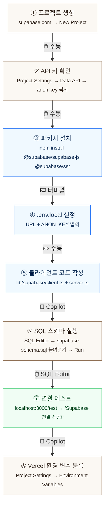

# Chapter 8. Supabase 시작하기 — A회차: 강의

> **미션**: 공감터(`mind-center`) 웹사이트에 Supabase 데이터베이스를 연결한다

---

## 이 장의 전체 흐름

아래 다이어그램이 이번 장에서 할 일의 **전부**이다. 8단계를 순서대로 진행하면 Supabase 연결이 완료된다.



| 단계 | 작업                            |    실행    | 도구     |  섹션   |
| :--: | ------------------------------- | :--------: | -------- | :-----: |
|  ①   | Supabase 프로젝트 생성          |  🖱️ 직접   | 브라우저 |  8.2.1  |
|  ②   | API URL + anon key 복사         |  🖱️ 직접   | 대시보드 |  8.2.3  |
|  ③   | `@supabase/ssr` 패키지 설치     | 🤖 Copilot | 터미널   |  8.3.1  |
|  ④   | `.env.local`에 키 입력          |  🖱️ 직접   | VS Code  |  8.3.2  |
|  ⑤   | `lib/supabase/client.ts` 작성   | 🤖 Copilot | VS Code  |  8.3.3  |
|  ⑥   | SQL 생성 + SQL Editor 실행      |   🤖+🖱️    | 대시보드 | 8.4.1~2 |
|  ⑦   | `localhost:3000/test` 연결 확인 | 🤖 Copilot | 브라우저 |  8.3.5  |
|  ⑧   | Vercel에 환경 변수 등록         |  🖱️ 직접   | Vercel   |  8.3.4  |

**고정 버전** (이 교재 기준):

| 패키지                  | 버전   |
| ----------------------- | ------ |
| `next`                  | 16.1.6 |
| `@supabase/supabase-js` | 2.97.0 |
| `@supabase/ssr`         | 0.8.0  |
| `tailwindcss`           | 4.x    |

---

## 바이브코딩 원칙 (이번 장)

이번 장의 바이브코딩 핵심은 “**DB/환경변수/연결 방식**을 Copilot이 추측하지 않게 만드는 것”이다. DB는 한 번 잘못 만들면 이후 장(인증, CRUD, RLS, UX) 전체가 꼬인다.

1. **스키마를 먼저 고정**: 테이블 이름/컬럼/타입/관계를 설계서(Ch7) 기준으로 확정하고, Copilot에게 그대로 준다.
2. **환경변수 이름을 정확히**: 로컬(`.env.local`)과 배포(Vercel) 값, `NEXT_PUBLIC_*` 공개 범위를 명시한다.
3. **Supabase 자원을 명시**: `auth.users` 기반 + 프로젝트의 `public.users`(Auth 확장) 같은 “확장 테이블” 사용 여부를 먼저 결정한다.
4. **실행 순서를 포함**: (1) 프로젝트 생성 → (2) 키 발급/환경변수 → (3) 클라이언트 연결 → (4) SQL 실행 → (5) Next.js에서 읽기 테스트.
5. **검증을 “쿼리”로 한다**: “잘 됐어요”가 아니라, `select`로 데이터가 보이고, 콘솔/네트워크가 정상인지로 확인한다.

---

## 제작 과정 (처음부터 시작)

Ch7에서 문서(ARCHITECTURE.md, copilot-instructions.md)로 “무엇을 만들지”를 정했다면, 이번 장에서는 **데이터베이스를 ‘사실(Truth)’로 고정**한다.  
여기서 스키마/키/연결이 흔들리면, 이후(인증/CRUD/RLS/UX) 단계는 전부 흔들린다.

### 8.0.1 Copilot이 강한 구간 vs 굳이 안 써도 되는 구간

- Copilot이 강한 구간: 스키마 초안 검토, SQL 스크립트 정리, 체크리스트/검증 쿼리 작성, Next.js 연결 코드 뼈대
- 굳이 안 써도 되는 구간: Supabase 대시보드 클릭 작업, 키 발급/복사/붙여넣기, 비밀키/권한 관리, 실제 SQL 실행 버튼 클릭

### 8.0.2 권장 제작 순서 (DB 고정 루트)

1. **Supabase 프로젝트 생성**: 프로젝트/리전/DB 패스워드를 정한다.
2. **환경변수 고정**: `.env.local`에 URL/ANON KEY를 넣고 “앱이 키를 읽는다”까지 확인한다.
3. **스키마 확정**: `supabase-schema.sql`을 기준으로 테이블/FK/제약을 만든다.
4. **RLS는 초안이라도 켠다**: 최소 정책(SELECT/INSERT)부터 걸어 “보안 기본값”을 만든다.
5. **연결 검증**: Next.js에서 SELECT 1개, INSERT 1개를 성공시키고 결과를 확인한다.

### 8.0.3 제작 과정용 Copilot 프롬프트 세트 (단계별)

#### (1) Supabase 프로젝트 생성 체크리스트

```text
너는 GitHub Copilot Chat이야. 지금부터 `mind-center` 프로젝트의 Supabase를 "처음부터" 세팅한다.
내가 대시보드에서 무엇을 해야 하는지 체크리스트로 안내해줘.

[요구 출력]
1) Supabase 프로젝트 생성 시 결정해야 할 것(프로젝트명/리전/DB 비밀번호)
2) 생성 후 바로 확인할 것: Project URL, anon key, service role key(사용 금지 안내 포함)
3) 로컬 개발에서 필요한 것 vs 배포(Vercel)에서 필요한 것 구분
4) 흔한 실수 TOP 5 (예: env 이름 오타, NEXT_PUBLIC 범위, 키를 커밋함 등)
```

#### (2) `.env.local` 설계 + 보안 규칙

```text
너는 GitHub Copilot Chat이야. Next.js(App Router)에서 Supabase를 연결하려고 한다.
`.env.local`에 넣을 환경변수 이름을 정확히 정리해줘(값은 비워둬).

[요구 출력]
- 필요한 env 목록(로컬용): 이름 + 설명 + 예시 형태(값은 ***로 마스킹)
- `NEXT_PUBLIC_`를 붙여야 하는 것/붙이면 안 되는 것
- `.gitignore`에 `.env.local`이 들어가야 하는 이유(1~2줄)
```

#### (3) Supabase 클라이언트 코드 뼈대(브라우저/서버)

```text
너는 GitHub Copilot Chat이야. Next.js App Router에서 Supabase 클라이언트를 표준 방식으로 구성하고 싶다.

[요구 출력]
1) 추천 파일 경로와 코드:
   - `lib/supabase/client.ts` (browser client)
   - `lib/supabase/server.ts` (server client, cookies 연동)
2) 각 파일이 언제 쓰이는지(클라이언트 컴포넌트 vs 서버 컴포넌트 vs route handler)

제약: `@supabase/ssr` 패턴을 사용하고, env 이름은 위에서 정한 것을 사용한다.
```

#### (4) 스키마 확정: `supabase-schema.sql` 실행/검토

```text
너는 GitHub Copilot Chat이야. 내가 Supabase SQL Editor에서 실행할 스키마 스크립트를 확정하려고 한다.

[컨텍스트]
- 프로젝트 문서: `ARCHITECTURE.md`의 Data Model(초안)
- 목표 기능: 예약, 마음톡, 게시판, 마이페이지

[요구 출력]
1) 테이블 목록(최소): users 확장, counselors, availability_slots, reservations, mindtalk_posts, mindtalk_comments, board_posts, news_posts
2) 각 테이블의 최소 컬럼(타입 수준까지)과 FK 관계 요약
3) SQL Editor에서 실행할 때의 순서/주의점(extensions, FK 순서, 트리거 등)

주의: 내가 실제로 붙여넣을 수 있게 `supabase-schema.sql` 파일 전체를 출력해줘.
```

#### (5) 연결 검증: “SELECT 1개 + INSERT 1개” 테스트

```text
너는 GitHub Copilot Chat이야. Supabase 연결이 제대로 됐는지 빠르게 검증하고 싶다.

[요구 출력]
1) SQL Editor에서 실행할 검증 쿼리 3개(SELECT/INSERT 포함) + 기대 결과
2) Next.js에서 실행할 검증 코드 2개:
   - 서버 컴포넌트에서 `select` 한 번
   - 클라이언트 컴포넌트에서 `insert` 한 번(로그인 전이면 임시로 공개 테이블로)
3) 실패했을 때 확인할 체크리스트(네트워크, env, RLS, 권한)
```

## Copilot 프롬프트 (복사/붙여넣기)

```text
너는 GitHub Copilot Chat이고, 내 Next.js(App Router) + Supabase 프로젝트의 페어 프로그래머야.
목표: `mind-center`에 Supabase를 연결하고, `ARCHITECTURE.md`/`supabase-schema.sql` 기준으로 테이블을 만들고, Next.js에서 읽기 테스트까지 끝낸다.

[기술/규칙]
- Next.js App Router 사용
- Supabase는 PostgreSQL 기반
- `auth.users`를 직접 쓰되, 프로젝트처럼 `public.users(id UUID REFERENCES auth.users)` 형태의 확장 테이블을 사용할 수 있다
- 임의의 테이블/컬럼 이름을 새로 만들지 말고, 먼저 `supabase-schema.sql`을 기준으로 맞춰라

[내 설계서 요약]
- Page Map 핵심 기능: 예약(`/reservation/*`), 마음톡(`/mindtalk`), 게시판(`/board/*`), 마이페이지(`/mypage/*`)
- 데이터 엔티티 예: `users`, `counselors`, `availability_slots`, `reservations`, `mindtalk_posts`, `mindtalk_comments`, `board_posts`, `news_posts`

[요구 출력]
1) `.env.local`에 넣을 환경변수 이름/설명(값은 내가 채움)
2) Next.js에서 Supabase 클라이언트를 쓰는 추천 파일 구조(생성할 파일 경로 포함)
3) Supabase SQL Editor에 붙여넣을 SQL: `supabase-schema.sql` 실행 순서/주의점 + (필요 시) 최소 수정안
4) 연결 검증용 테스트 쿼리 3개(SELECT/INSERT 포함): 예) 상담사 목록 조회, 마음톡 글 1개 insert, 예약 조회 + 기대 결과

주의: 내가 제공한 스키마/관계 외에는 임의로 추가/변경하지 말고, 애매하면 질문해줘.
```

## 학습목표

1. BaaS(Backend as a Service)의 개념과 장점을 설명할 수 있다
2. Supabase 프로젝트를 생성하고 대시보드를 탐색할 수 있다
3. Next.js 프로젝트에 Supabase 클라이언트를 설치하고 환경 변수를 설정할 수 있다
4. 7장 설계서를 기반으로 SQL 테이블을 생성할 수 있다
5. 테이블 관계(1:N)를 이해하고 외래 키를 설정할 수 있다

---

## 수업 타임라인

**표 8.1** A회차 수업 타임라인

| 시간        | 내용                                                   |
| ----------- | ------------------------------------------------------ |
| 00:00~00:05 | 오늘의 미션 + 빠른 진단                                |
| 00:05~00:25 | BaaS 개념 + Supabase 프로젝트 생성 + 대시보드 탐색     |
| 00:25~00:50 | Next.js 연결 + 환경 변수 + Vercel 배포 설정            |
| 00:50~01:20 | 라이브 코딩: 데이터 모델링 + 테이블 생성 + 연결 테스트 |
| 01:20~01:27 | 핵심 정리 + B회차 과제 스펙 공개                       |
| 01:27~01:30 | Exit ticket                                            |

---

## 오늘의 미션 + 빠른 진단

> **오늘의 질문**: "지금까지 만든 게시판은 새로고침하면 데이터가 사라진다. 어떻게 하면 데이터를 영구적으로 저장할 수 있을까?"

**빠른 진단** (1문항):

다음 중 BaaS(Backend as a Service)의 설명으로 올바른 것은?

- (A) 백엔드 서버 코드를 직접 작성하여 배포하는 방식
- (B) 백엔드 기능(DB, 인증, API)을 서비스로 제공받아 사용하는 방식
- (C) 프론트엔드 없이 서버만으로 앱을 만드는 방식

정답: (B) — BaaS는 데이터베이스, 인증, API 등을 이미 만들어진 서비스로 사용한다.

---

## 8.1 왜 Supabase인가?

Ch5~6에서 만든 게시판은 새로고침하면 데이터가 사라진다. 데이터를 영구 저장하려면 **데이터베이스**가 필요하고, 이 수업에서는 **Supabase**를 사용한다.

**Supabase 선택 이유**: PostgreSQL 기반(SQL 학습 가능), 오픈소스(종속 없음), 무료(2개 프로젝트), Next.js 공식 연동(Vercel 파트너).

> **원리 — BaaS(Backend as a Service)**
>
> 전통 방식은 백엔드 서버(Express, Django 등)를 직접 만들어야 하지만, BaaS는 DB·인증·API를 **이미 만들어진 서비스**로 제공한다. 주방을 직접 짓는 대신 **공유 주방을 빌리는 것**과 같다.
>
> **표 8.2** BaaS가 제공하는 기능
>
> | 기능         | 직접 만들면                  | BaaS(Supabase) 사용 시    |
> | ------------ | ---------------------------- | ------------------------- |
> | 데이터베이스 | PostgreSQL 설치, 스키마 설계 | 대시보드에서 테이블 생성  |
> | 인증         | 회원가입, OAuth 직접 구현    | `signInWithOAuth()` 한 줄 |
> | API          | REST 엔드포인트 설계         | 테이블 생성 시 자동 생성  |
> | 보안         | 미들웨어, 권한 체크 구현     | RLS 정책으로 DB 레벨 강제 |

---

## 8.2 Supabase 프로젝트 생성 `🖱️ 직접 실행`

지금부터 Supabase 프로젝트를 직접 만든다. 이 설정은 Ch9~11까지 계속 사용하므로 정확히 따라한다.

> **왜 수동인가?** — Supabase 대시보드 회원가입/프로젝트 생성/키 복사는 브라우저에서 직접 해야 한다. Copilot이 대신할 수 없는 영역이다.

### 8.2.1 가입 및 새 프로젝트 만들기

> **함께 진행**: 화면을 보며 함께 따라한다

① **Supabase 가입**: https://supabase.com 에서 **GitHub 계정으로 가입**한다 (별도 이메일 가입 불필요)

② **새 프로젝트 생성**: 대시보드에서 "New Project" 클릭

③ **프로젝트 설정**:

**표 8.3** 프로젝트 생성 시 입력 항목

| 항목              | 입력 값                | 설명                                   |
| ----------------- | ---------------------- | -------------------------------------- |
| Organization      | (기본값)               | 개인 조직                              |
| Project name      | `my-board`             | 영문 소문자, 하이픈 사용               |
| Database Password | (강한 비밀번호)        | **반드시 메모해둔다** — 이후 변경 불가 |
| Region            | Northeast Asia (Tokyo) | 한국에서 가장 가까운 리전              |
| Pricing Plan      | Free                   | 무료 플랜 선택                         |

④ **생성 대기**: 프로젝트 생성에 약 1~2분이 걸린다. 이 사이 대시보드 구조를 살펴본다.

> **팁**: Database Password는 나중에 변경할 수 없다. 비밀번호를 까먹으면 프로젝트를 삭제하고 다시 만들어야 한다. 반드시 어딘가에 적어두자.

### 8.2.2 대시보드 탐색: Table Editor, SQL Editor, Auth

Supabase 대시보드는 백엔드의 모든 기능을 한 곳에서 관리하는 **제어판**이다. 핵심 메뉴 4가지를 익힌다:

**표 8.4** Supabase 대시보드 핵심 메뉴

| 메뉴                 | 역할                          | 이 수업에서 사용 시점  |
| -------------------- | ----------------------------- | ---------------------- |
| **Table Editor**     | 테이블 생성/수정, 데이터 확인 | Ch8 (오늘), Ch10       |
| **SQL Editor**       | SQL 문 직접 실행              | Ch8 (오늘), Ch10, Ch11 |
| **Authentication**   | 인증 설정, 사용자 목록        | Ch9                    |
| **Project Settings** | API 키, URL 확인              | Ch8 (오늘)             |

다른 메뉴(Storage, Edge Functions, Realtime 등)는 이 수업에서 다루지 않지만, 프로젝트가 성장하면 필요해질 수 있다.

### 8.2.3 API 키 확인

Supabase와 Next.js를 연결하려면 두 가지 정보가 필요하다:

① **API URL**: `https://[프로젝트ID].supabase.co` 형태
② **anon (public) key**: 클라이언트에서 사용하는 공개 키 (JWT 형식)

2026년 현재 Supabase 대시보드는 API 키 체계가 개편되었다. **API URL**과 **API Key**의 확인 위치가 다르므로 주의한다.

**① API URL 확인**: 왼쪽 사이드바 **Integrations** → **Data API** → **API URL**

```text
API URL:  https://abcdefghijk.supabase.co    [Copy]
```

Data API 페이지에서 **Enable Data API** 토글이 켜져 있는지도 확인한다. 이 토글이 꺼져 있으면 Supabase 클라이언트 라이브러리가 작동하지 않는다.

**② API Key 확인**: 왼쪽 사이드바 **Project Settings** → **API Keys**

API Keys 페이지에는 **두 개의 탭**이 있다:

| 탭                                     | 내용                                                        |
| -------------------------------------- | ----------------------------------------------------------- |
| **Publishable and secret API keys**    | 새로운 키 체계 (`sb_publishable_...`, `sb_secret_...` 형식) |
| **Legacy anon, service_role API keys** | 기존 JWT 기반 키 (`eyJhbG...` 형식)                         |

현재 `@supabase/supabase-js` 라이브러리는 **Legacy 탭**의 JWT 형식 키를 사용한다. **"Legacy anon, service_role API keys"** 탭을 클릭하여 `anon` `public` 키를 복사한다:

```text
anon  public    eyJhbGciOiJIUzI1NiIsInR5cCI6IkpXVCJ9...    [Copy]
```

> anon key가 공개 가능하다는 것이 의외일 수 있다. Supabase는 **RLS(Row Level Security)**로 데이터를 보호한다. anon key로 접근해도 RLS 정책이 허용한 데이터만 볼 수 있다. RLS는 Ch11에서 자세히 다룬다.

> **팁**: anon key는 "집 주소"와 같다. 주소는 알려줘도 되지만, 실제 데이터를 보호하는 것은 RLS(잠금 장치)의 역할이다.

---

## 8.3 Next.js와 Supabase 연결

Supabase 프로젝트가 준비되었으면 기존 Next.js 프로젝트에 연결한다.

### 8.3.1 패키지 설치 `⌨️ 터미널`

> **🤖 Copilot 프롬프트**
> "Next.js App Router 프로젝트에 Supabase 클라이언트를 설치하고 초기 설정하는 방법을 알려줘.
> @supabase/supabase-js와 @supabase/ssr 두 패키지가 필요해."

Copilot이 알려주는 명령어를 터미널에 붙여넣는다:

```bash
npm install @supabase/supabase-js @supabase/ssr
```

설치 후 **버전 확인** — 설치된 Supabase 패키지 버전을 확인하고 copilot-instructions.md에 기록한다:

```bash
node -e "const p = require('./package.json'); console.log('@supabase/supabase-js:', p.dependencies['@supabase/supabase-js']); console.log('@supabase/ssr:', p.dependencies['@supabase/ssr'])"
```

copilot-instructions.md의 Tech Stack 섹션에 추가한다:

```markdown
## Tech Stack

- @supabase/supabase-js [확인한 버전]
- @supabase/ssr [확인한 버전]
```

> 새로운 패키지를 설치할 때마다 버전을 확인하고 copilot-instructions.md에 기록하는 습관을 들이자. 이것이 Ch2에서 배운 **버전 동기화 프로토콜**이다.

**표 8.5** Supabase 패키지 역할

| 패키지                  | 역할                                         |
| ----------------------- | -------------------------------------------- |
| `@supabase/supabase-js` | Supabase 핵심 클라이언트 (DB, Auth, Storage) |
| `@supabase/ssr`         | Next.js App Router에서 쿠키 기반 세션 관리   |

`@supabase/ssr`은 **서버 컴포넌트**(Server Component)와 **클라이언트 컴포넌트**(Client Component) 양쪽에서 Supabase를 안전하게 사용하기 위한 패키지이다. Next.js App Router 환경에서는 반드시 함께 설치한다.

### 8.3.2 환경 변수 설정 (.env.local) `🖱️ 직접 실행`

API 키를 프로젝트에 저장한다. 프로젝트 루트에 `.env.local` 파일을 생성한다:

```bash
# .env.local
NEXT_PUBLIC_SUPABASE_URL=https://[프로젝트ID].supabase.co
NEXT_PUBLIC_SUPABASE_ANON_KEY=eyJhbGciOiJIUzI1NiIsInR5cCI6IkpXVCJ9...
```

**주의할 점 3가지**:

1. **`NEXT_PUBLIC_` 접두사**: Next.js에서 브라우저에 노출할 환경 변수에는 반드시 `NEXT_PUBLIC_` 접두사를 붙인다. 이 접두사가 없으면 서버에서만 사용 가능하다.

2. **`.gitignore` 확인**: `.env.local`은 기본적으로 `.gitignore`에 포함되어 있다. **절대 Git에 커밋하지 않는다**.

3. **실제 값 입력**: `[프로젝트ID]`와 `eyJhbG...` 부분을 본인의 Supabase 대시보드에서 확인한 값으로 교체한다.

> **흔한 실수**: `.env.local` 대신 `.env`에 키를 넣는 경우. `.env`는 Git에 커밋될 수 있다. 반드시 `.env.local`을 사용한다.

### 8.3.3 Supabase 클라이언트 초기화 `🤖 바이브코딩`

> **🤖 Copilot 프롬프트**
> "Next.js App Router에서 Supabase 클라이언트를 초기화하는 유틸리티 파일을 만들어줘.
> @supabase/ssr 패키지를 사용해서, 브라우저용(lib/supabase/client.ts)과 서버용(lib/supabase/server.ts) 두 파일을 만들어줘."

Supabase 공식 문서에서는 **브라우저용**과 **서버용** 두 개의 클라이언트를 분리한다. 먼저 폴더 구조를 만든다:

```
lib/
└── supabase/
    ├── client.ts    ← 브라우저용 (Client Component에서 사용)
    └── server.ts    ← 서버용 (Server Component, Route Handler에서 사용)
```

**브라우저용 클라이언트**:

```typescript
// lib/supabase/client.ts
import { createBrowserClient } from "@supabase/ssr";

export function createClient() {
  return createBrowserClient(
    process.env.NEXT_PUBLIC_SUPABASE_URL!,
    process.env.NEXT_PUBLIC_SUPABASE_ANON_KEY!,
  );
}
```

> `!`(non-null assertion)는 TypeScript에게 "이 값은 반드시 존재한다"고 알려주는 것이다. 환경 변수가 `.env.local`에 올바르게 설정되어 있다면 안전하다.

**코드 읽기 가이드** — 3줄이지만 중요한 포인트가 있다:

**표 8.6** Supabase 브라우저 클라이언트 코드 해석

| 줄  | 코드                             | 의미                                                                |
| --- | -------------------------------- | ------------------------------------------------------------------- |
| 1   | `import { createBrowserClient }` | `@supabase/ssr`에서 **브라우저용** 클라이언트 생성 함수를 가져온다  |
| 3   | `export function createClient()` | **팩토리 함수** — 호출할 때마다 클라이언트를 생성한다               |
| 4-5 | `process.env.NEXT_PUBLIC_...!`   | `.env.local`에 설정한 환경 변수를 읽는다 (`!`는 non-null assertion) |

> 왜 `createClient`라는 이름인가? Supabase 공식 문서가 이 이름을 사용한다. 프로젝트 전체에서 `import { createClient } from "@/lib/supabase/client"`로 통일하면 코드가 일관된다.

**서버용 클라이언트** — 서버 컴포넌트에서도 Supabase를 사용해야 하는 경우가 있다(예: 초기 데이터 로딩, 인증 확인). 이때는 **쿠키를 처리하는** 서버용 클라이언트가 필요하다:

```typescript
// lib/supabase/server.ts
import { createServerClient } from "@supabase/ssr";
import { cookies } from "next/headers";

export async function createClient() {
  const cookieStore = await cookies();
  return createServerClient(
    process.env.NEXT_PUBLIC_SUPABASE_URL!,
    process.env.NEXT_PUBLIC_SUPABASE_ANON_KEY!,
    {
      cookies: {
        getAll() {
          return cookieStore.getAll();
        },
        setAll(cookiesToSet) {
          try {
            cookiesToSet.forEach(({ name, value, options }) =>
              cookieStore.set(name, value, options),
            );
          } catch {
            // Server Component에서 호출 시 쿠키 쓰기 불가 — middleware가 처리
          }
        },
      },
    },
  );
}
```

**표 8.7** 브라우저 vs 서버 클라이언트 비교

|               | 브라우저 (`client.ts`)  | 서버 (`server.ts`)              |
| ------------- | ----------------------- | ------------------------------- |
| **import**    | `createBrowserClient`   | `createServerClient`            |
| **사용 위치** | `"use client"` 컴포넌트 | Server Component, Route Handler |
| **쿠키**      | 자동 처리               | `cookies()` 수동 연결           |
| **Ch9 이후**  | 로그인/로그아웃 UI      | 미들웨어, 보호된 페이지         |

서버용 클라이언트는 Ch9(인증)에서 본격적으로 사용한다. 지금은 `lib/supabase/client.ts`(브라우저용)만 있으면 충분하다.

**검증 체크리스트** — 클라이언트 초기화가 올바른지 확인:

- [ ] `@supabase/ssr`의 `createBrowserClient`를 사용하는가? (구버전인 `createClient` from `@supabase/supabase-js`를 직접 사용하면 쿠키 처리가 안 된다)
- [ ] 환경 변수 이름이 `.env.local`과 정확히 일치하는가?
- [ ] `service_role` 키가 아닌 `anon` 키를 사용하는가?
- [ ] `lib/supabase/client.ts`와 `lib/supabase/server.ts` 두 파일이 모두 있는가?

> **함께 진행**: 함께 `lib/supabase/client.ts` 파일을 만들고, 개발 서버에서 에러 없이 실행되는지 확인한다

### 8.3.4 Vercel 환경 변수 등록 + 배포 `🖱️ 직접 실행`

`.env.local`은 **로컬 개발 전용**이다. Vercel에 배포하면 `.env.local`은 무시된다. Vercel 대시보드에 환경 변수를 **별도 등록**해야 한다.

> **왜 수동인가?** — Vercel 대시보드는 브라우저에서만 조작 가능하다. 환경 변수에는 API 키가 포함되므로 사람이 직접 확인하며 등록해야 한다.

**① Vercel 대시보드 접속**

https://vercel.com → 로그인 → 프로젝트 선택

**② 환경 변수 등록**

경로: **Settings** → **Environment Variables**

| Key                             | Value                              |                Environment                 |
| ------------------------------- | ---------------------------------- | :----------------------------------------: |
| `NEXT_PUBLIC_SUPABASE_URL`      | `https://[프로젝트ID].supabase.co` | Production, Preview, Development 모두 체크 |
| `NEXT_PUBLIC_SUPABASE_ANON_KEY` | `eyJhbGciOi...` (anon key 전체)    | Production, Preview, Development 모두 체크 |

각 변수 입력 후 **Add** 버튼을 클릭한다.

**③ 재배포 (필수)**

환경 변수를 등록한 후 **반드시 재배포**해야 적용된다:

- 방법 1: **Deployments** 탭 → 가장 최근 배포의 `⋮` 메뉴 → **Redeploy** 클릭
- 방법 2: 코드를 수정하고 `git push` → 자동 재배포

**④ 배포 확인**

배포 완료 후 Vercel이 제공하는 URL(`https://프로젝트명.vercel.app`)에 접속하여 정상 작동하는지 확인한다.

**Vercel 배포 트러블슈팅**:

| 증상                               | 원인                      | 해결                                                  |
| ---------------------------------- | ------------------------- | ----------------------------------------------------- |
| "로컬에서 되는데 배포하면 안 돼요" | Vercel에 환경 변수 미등록 | Settings → Environment Variables 확인                 |
| 환경 변수 등록했는데 안 됨         | 재배포 안 함              | Redeploy 필수                                         |
| `NEXT_PUBLIC_` 변수가 `undefined`  | Key 이름 오타             | `.env.local`과 Vercel 대시보드의 Key 이름 정확히 비교 |
| 빌드 실패                          | 코드 에러 or 패키지 문제  | Vercel → Deployments → 빌드 로그 확인                 |

> **팁**: "로컬에서 되는데 배포하면 안 돼요"의 **90%는 Vercel에 환경 변수를 안 넣었기 때문**이다. 이 단계를 반드시 확인하자.

### 8.3.5 연결 테스트 `🤖 바이브코딩`

> **라이브 코딩**: Supabase 프로젝트를 생성하고 Next.js와 연결한 뒤, 연결 테스트까지 전 과정을 진행한다.

모든 설정이 끝났으면 실제로 연결이 되는지 확인한다. 임시로 페이지에 테스트 코드를 작성한다:

```tsx
// app/test/page.tsx — 연결 확인용 (나중에 삭제)
"use client";

import { createClient } from "@/lib/supabase/client";
import { useEffect, useState } from "react";

export default function TestPage() {
  const [status, setStatus] = useState("확인 중...");

  useEffect(() => {
    const supabase = createClient();
    supabase
      .from("_connection_test")
      .select("*")
      .limit(0)
      .then(({ error }) => {
        if (error?.message?.includes("Failed to fetch")) {
          setStatus("연결 실패 — 환경 변수를 확인하세요");
        } else {
          setStatus("Supabase 연결 성공!");
        }
      });
  }, []);

  return (
    <div className="p-8">
      <h1 className="text-2xl font-bold">Supabase 연결 테스트</h1>
      <p className="mt-4 text-lg">{status}</p>
    </div>
  );
}
```

`http://localhost:3000/test`에 접속해서 "Supabase 연결 성공!"이 보이면 설정이 올바르다.

> 연결 확인이 끝나면 `app/test/` 폴더는 삭제해도 된다. 배포 전에 정리하는 습관을 들인다.

---

## 8.4 데이터 모델링

Supabase 연결이 완료되었다. 이제 **데이터를 저장할 그릇(테이블)**을 만들 차례이다.

> **원리 — 관계형 데이터베이스 기초**
>
> Supabase는 **PostgreSQL**(관계형 DB)을 사용한다. 데이터를 **표(테이블)** 형태로 저장하며, 엑셀 시트와 비슷하다.
>
> | 용어              | 비유       | 설명                           |
> | ----------------- | ---------- | ------------------------------ |
> | **테이블(Table)** | 엑셀 시트  | 같은 종류의 데이터를 모은 표   |
> | **행(Row)**       | 엑셀 한 줄 | 데이터 하나 (게시글 1개)       |
> | **열(Column)**    | 칸 제목    | 데이터의 속성 (제목, 내용)     |
> | **기본 키(PK)**   | 주민번호   | 각 행을 고유하게 구분하는 값   |
> | **외래 키(FK)**   | 소속 코드  | 다른 테이블의 행을 참조하는 값 |

### 8.4.1 SQL 생성 — Copilot에게 요청 `🤖 바이브코딩`

Ch7에서 ARCHITECTURE.md에 설계한 데이터 모델을 **실제 SQL 테이블**로 만든다. 게시판에 필요한 최소 테이블은 `profiles`(사용자)와 `posts`(게시글) 2개이다.

> **왜 `users`가 아닌 `profiles`인가?** — Supabase Auth는 내부적으로 `auth.users`를 관리한다. 추가 정보(닉네임 등)는 **별도 `profiles` 테이블**을 만들어 `auth.users`와 연결한다(공식 패턴).

Copilot에게 SQL을 요청한다. **구체적인 프롬프트**가 핵심이다:

> **❌ 나쁜 프롬프트** — "Supabase에서 게시판 테이블 만들어줘" → AI가 임의로 열 이름/타입을 정하고, `auth.users` 연결 없이 자체 `users` 테이블을 만들 위험.

> **🤖 Copilot 프롬프트**
> "Supabase에서 게시판을 위한 SQL 테이블을 만들어줘.
> profiles 테이블(id, username, avatar_url)과 posts 테이블(id, title, content, user_id, created_at)이 필요해.
> profiles.id는 auth.users.id를 참조하고, posts.user_id는 profiles.id를 참조해.
> RLS는 아직 설정하지 마."

Copilot이 생성한 SQL을 **읽고 확인**한다:

```sql
-- profiles 테이블
create table profiles (
  id uuid references auth.users(id) on delete cascade,
  username text,
  avatar_url text,
  created_at timestamptz default now(),
  primary key (id)
);

-- posts 테이블
create table posts (
  id bigint generated always as identity primary key,
  title text not null,
  content text not null,
  user_id uuid references profiles(id) on delete cascade not null,
  created_at timestamptz default now()
);
```

**코드 읽기 가이드** — SQL을 처음 보더라도 읽을 수 있도록 한 줄씩 해석한다:

**표 8.8** profiles 테이블 SQL 해석

| SQL                                    | 의미                                           |
| -------------------------------------- | ---------------------------------------------- |
| `create table profiles (...)`          | `profiles`라는 이름의 테이블을 생성한다        |
| `id uuid`                              | `id` 열의 타입은 UUID (고유 식별자)            |
| `references auth.users(id)`            | Supabase Auth의 `users` 테이블 `id`를 참조한다 |
| `on delete cascade`                    | 사용자가 삭제되면 프로필도 함께 삭제된다       |
| `username text`                        | 문자열 타입의 `username` 열                    |
| `created_at timestamptz default now()` | 생성 시각, 기본값은 현재 시간                  |
| `primary key (id)`                     | `id`를 기본 키로 설정                          |

**표 8.9** posts 테이블 SQL 해석

| SQL                                      | 의미                                     |
| ---------------------------------------- | ---------------------------------------- |
| `id bigint generated always as identity` | 자동 증가하는 숫자 ID                    |
| `title text not null`                    | 제목, 빈 값 불허                         |
| `content text not null`                  | 내용, 빈 값 불허                         |
| `user_id uuid references profiles(id)`   | 작성자, `profiles` 테이블의 `id`를 참조  |
| `on delete cascade not null`             | 작성자 삭제 시 게시글도 삭제, 빈 값 불허 |
| `created_at timestamptz default now()`   | 생성 시각, 기본값은 현재 시간            |

> **원리 — 1:N (일대다) 관계**
>
> `profiles (1) ──────< posts (N)` — "한 사용자가 여러 게시글을 쓸 수 있지만, 하나의 게시글은 한 사용자에게만 속한다."
> `posts.user_id`(외래 키)가 `profiles.id`를 참조하므로, 게시글 조회 시 작성자 정보를 함께 가져올 수 있고, 존재하지 않는 사용자 ID로 게시글을 만들 수 없다(참조 무결성).

### 8.4.2 SQL 실행 `🖱️ 직접 실행`

Copilot이 생성한 SQL을 Supabase 대시보드의 **SQL Editor**에 붙여넣고 실행한다.

> **왜 수동인가?** — SQL Editor는 브라우저 대시보드이므로 Copilot이 직접 실행할 수 없다. Copilot이 만든 SQL을 **복사 → SQL Editor에 붙여넣기 → Run 버튼 클릭**으로 진행한다.

> **함께 진행**: SQL Editor를 열고, SQL을 붙여넣고, "Run" 버튼을 클릭한다

실행 후 **Table Editor**로 이동하면 `profiles`와 `posts` 테이블이 생성된 것을 확인할 수 있다.

> **흔한 실수**: SQL을 두 번 실행하면 "relation already exists" 에러가 발생한다. 이미 테이블이 있다면 Table Editor에서 삭제 후 다시 실행하거나, SQL 앞에 `drop table if exists posts; drop table if exists profiles;`를 추가한다 (순서 주의: posts를 먼저 삭제해야 외래 키 참조 에러가 안 난다).

**표 8.10** 흔한 AI 실수 — Supabase 클라이언트 설정 + SQL

| 실수 패턴                                             | 증상                           | 해결                                         |
| ----------------------------------------------------- | ------------------------------ | -------------------------------------------- |
| `createClient` from `@supabase/supabase-js` 직접 사용 | 쿠키 기반 세션이 작동하지 않음 | `@supabase/ssr`의 `createBrowserClient` 사용 |
| 환경 변수에 `NEXT_PUBLIC_` 접두사 누락                | 브라우저에서 `undefined`       | `.env.local` 키 이름에 접두사 추가           |
| `.env` 파일 사용 (`.env.local` 대신)                  | Git에 키가 노출됨              | `.env.local`로 변경, Git 이력에서 키 제거    |
| `service_role` 키를 브라우저에서 사용                 | 보안 취약점 (RLS 무시)         | `anon` 키만 브라우저에서 사용                |
| `auth.users` 대신 자체 `users` 테이블 생성            | Supabase 인증과 연동 불가      | `profiles` → `auth.users(id)` 참조 패턴 사용 |
| `uuid` 대신 `int` 타입 사용                           | Auth 사용자 ID와 타입 불일치   | `profiles.id`는 반드시 `uuid`                |

---

## 8.5 컨텍스트 업데이트

Ch7에서 배운 외부 컨텍스트 파일 관리 패턴을 이번 장에서도 적용한다. Supabase 설정은 **한 번 하면 끝**이지만, "무엇을 설정했고, 어떤 키를 어디에 넣었는지"를 기록해두지 않으면 다음 세션에서 Copilot이 혼란을 겪는다.

**세션 시작 프롬프트** — Ch8 작업을 시작할 때 Copilot Chat에 입력:

```text
#file:context.md #file:todo.md #file:ARCHITECTURE.md

Ch8 Supabase 연결을 시작하려고 해.
context.md에서 현재 상태를 파악하고,
todo.md에서 Supabase 관련 할 일을 확인해줘.
Supabase 클라이언트 설정은 copilot-instructions.md 규칙을 따라줘.
```

**이 장에서 context.md에 추가할 내용**:

```markdown
## 기술 결정 사항 (Ch8 추가)

- 백엔드: Supabase (PostgreSQL + Auth + Storage)
- Supabase 프로젝트 리전: Northeast Asia (ap-northeast-1)
- 클라이언트: @supabase/ssr의 createBrowserClient 사용
- 환경 변수: .env.local에 NEXT_PUBLIC_SUPABASE_URL, NEXT_PUBLIC_SUPABASE_ANON_KEY 설정 완료

## 해결된 이슈 (Ch8)

- anon key vs service_role key 혼동 → 브라우저에서는 반드시 anon key만 사용
- .env.local 변경 후 반영 안 됨 → 개발 서버 재시작(npm run dev) 필요

## 알게 된 점 (Ch8)

- Supabase API 키 위치: Project Settings → Data API (2026년 기준)
- profiles 테이블은 auth.users(id)를 참조하는 uuid 타입이어야 한다
```

**세션 종료 프롬프트** — 작업을 마칠 때:

```text
Ch8 Supabase 설정을 마무리하려고 해.
context.md를 업데이트해줘:
- 기술 결정 사항: Supabase 프로젝트 설정 내용
- 해결된 이슈: 설정 중 겪은 문제와 해결법
- 알게 된 점: API 키 위치, 환경 변수 주의사항 등
todo.md에서 "Supabase 프로젝트 생성", "데이터베이스 스키마 작성" 항목을 체크하고 진행률을 갱신해줘.
```

> **주의**: `.env.local`의 실제 키 값은 context.md에 절대 적지 않는다. "설정 완료"만 기록한다.

---

## 핵심 정리 + B회차 과제 스펙

### 이번 시간 핵심 3가지

1. **BaaS**는 백엔드를 직접 만들지 않고 서비스로 사용하는 방식이다 — Supabase는 PostgreSQL 기반 오픈소스 BaaS이다
2. **환경 변수**는 `.env.local`에 저장하고, `NEXT_PUBLIC_` 접두사를 붙이고, Vercel에도 별도 등록한다
3. **관계형 데이터베이스**는 테이블(표) 형태로 데이터를 저장한다 — `profiles`와 `posts`가 1:N 관계로 연결된다

### B회차 과제 스펙

**Supabase 연동 + 데이터 읽기 페이지 배포**:

1. Supabase 프로젝트 생성 + API 키 확인
2. `.env.local` 환경 변수 설정
3. `lib/supabase/client.ts` + `lib/supabase/server.ts` 클라이언트 초기화
4. SQL Editor에서 `profiles` + `posts` 테이블 생성
5. 연결 테스트 성공 확인
6. Vercel 환경 변수 등록 + 배포

**스타터 코드**: `practice/chapter8/starter/` — Supabase 패키지가 설치된 Next.js 프로젝트와 비어 있는 `lib/supabase/` 폴더가 준비되어 있다.

---

## Exit ticket

다음 코드에서 잘못된 부분을 찾아라:

```typescript
// lib/supabase.ts
import { createClient } from "@supabase/supabase-js";

export function initSupabase() {
  return createClient(
    "https://abc123.supabase.co",
    "eyJhbGciOiJIUzI1NiIsInR5cCI6IkpXVCJ9...",
  );
}
```

정답: (1) `@supabase/supabase-js`의 `createClient` 대신 `@supabase/ssr`의 `createBrowserClient`를 사용해야 한다 (쿠키 기반 세션 지원), (2) URL과 키가 하드코딩되어 있다 — `process.env.NEXT_PUBLIC_...`으로 환경 변수를 사용해야 한다, (3) 함수명을 `createClient`로 통일하면 코드 일관성이 높아진다.

---

## 학습 체크리스트

**수업 전 준비**:

- [ ] Supabase 계정 가입 (https://supabase.com)
- [ ] `.env.local` 예시 파일 확인
- [ ] SQL 테이블 생성 스크립트 준비 (복사-붙여넣기용)

**자기 점검**:

- [ ] BaaS 개념과 Supabase의 역할을 이해했는가
- [ ] anon key vs service_role key 차이를 이해했는가
- [ ] 환경 변수 설정 방법 (`.env.local` + Vercel)을 이해했는가
- [ ] 관계형 데이터베이스의 테이블/행/열 개념을 이해했는가
- [ ] 세션 종료 시 context.md에 Supabase 설정 내용을 기록했는가
