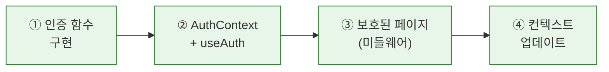

# Chapter 9. Supabase Authentication — A회차: 강의

> **미션**: 공감터(`mind-center`) 웹사이트에 이메일/비밀번호 로그인을 연결한다

---

## 바이브코딩 원칙 (이번 장)

이번 장의 바이브코딩은 “**인증 흐름을 글로 먼저 고정**하고, Copilot이 그 흐름대로만 코드를 만들게 하는 것”이 핵심이다. 인증은 작은 누락(쿠키, 미들웨어) 하나로 전체가 안 된다.

1. **로그인 방식 고정**: 이번 장은 “이메일/비밀번호” 1가지. 다른 방식(Google, 카카오, 네이버 등)을 Copilot이 섞지 못하게 막는다.
2. **이동 경로를 명시**: 로그인 후 이동 경로를 프롬프트에 포함한다.
3. **세션 저장 위치를 명시**: App Router에서의 쿠키/세션 처리 방식(예: `@supabase/ssr` 사용 여부)을 확정한다.
4. **보호 범위를 정의**: “어떤 페이지/행동이 로그인 필요인지”를 목록으로 정한다. (예: 글쓰기/수정/삭제)
5. **검증 시나리오로 확인**: (1) 로그인 성공 (2) 새로고침 후 유지 (3) 로그아웃 (4) 비로그인 접근 차단 4가지를 통과해야 완료다.

---

## Copilot 프롬프트 (복사/붙여넣기)

```text
너는 GitHub Copilot Chat이고, 내 Next.js(App Router) + Supabase 프로젝트의 인증 구현 파트너야.
목표: 이메일/비밀번호 로그인 + 로그아웃 + 인증 상태 유지 + 보호된 페이지(또는 액션)까지 구현한다.

[확정된 요구사항]
- 로그인 방식: 이메일/비밀번호
- 회원가입: 이메일/비밀번호 + 이름 입력
- 로그인 필요 기능: (예: `/mindtalk/new`, `/mypage/*`, 예약 신청 폼 제출)
- 로그인 후 이동: (예: `/mypage` 또는 `/mindtalk`)
- 로그아웃 후 이동: (예: `/`)

[환경]
- 로컬 URL: http://localhost:3000
- 배포 URL: (예: https://___vercel.app)
- Supabase 프로젝트가 아직 없다면: 먼저 프로젝트 생성 → URL/anon key 확보 → `.env.local` 설정까지 완료한 뒤 진행

[요구 출력]
1) Next.js 쪽에서 생성/수정할 파일 목록과 역할(경로 단위로: `/login`, `/signup`, 보호 라우팅)
2) 로그인/로그아웃 UI 최소 구현안(헤더 버튼 + 마이페이지 진입)
3) 인증 상태 확인(세션 유지) 테스트 시나리오 4개 + 실패 시 디버깅 힌트

주의: 내가 제공한 스택/요구사항 외의 라이브러리 도입은 하지 말고, 애매하면 질문해줘.
```

## 전체 워크플로



**표 9.1** 실행 단계 요약

| 단계 | 내용                                             | 실행 |  절   |
| :--: | ------------------------------------------------ | :--: | :---: |
|  ①   | signInWithEmail · signUpWithEmail · signOut 구현 |  🤖  |  9.3  |
|  ②   | AuthContext + useAuth 전역 상태 · header.tsx UI  |  🤖  |  9.4  |
|  ③   | middleware.ts 보호 라우트                        |  🤖  | 9.4.3 |
|  ④   | context.md 업데이트                              |  🤖  |  9.5  |

> 🖱️ = 사람이 직접 실행 (대시보드/외부 서비스) · 🤖 = 바이브코딩 (Copilot)

---

## 학습목표

1. 인증(Authentication)과 인가(Authorization)의 차이를 설명할 수 있다
2. Supabase로 이메일/비밀번호 인증을 구현할 수 있다
3. 인증 상태를 전역으로 관리하고 보호된 페이지를 만들 수 있다
4. 로그인/로그아웃 UI를 구현할 수 있다

---

## 수업 타임라인

**표 9.2** A회차 수업 타임라인

| 시간        | 내용                                                              |
| ----------- | ----------------------------------------------------------------- |
| 00:00~00:05 | 오늘의 미션 + 빠른 진단                                           |
| 00:05~00:30 | 인증 개념 + 세션/토큰 + 이메일/비밀번호 인증                      |
| 00:30~01:20 | 라이브 코딩: 이메일 로그인/회원가입 + AuthContext + 보호된 페이지 |
| 01:20~01:27 | 핵심 정리 + B회차 과제 스펙 공개                                  |
| 01:27~01:30 | Exit ticket                                                       |

---

## 오늘의 미션 + 빠른 진단

> **오늘의 질문**: "현재 게시판에 아무나 글을 쓸 수 있다. 어떻게 하면 '로그인한 사용자만' 글을 쓸 수 있게 만들 수 있을까?"

**빠른 진단** (1문항):

다음 중 인증(Authentication)과 인가(Authorization)를 올바르게 설명한 것은?

- (A) 인증은 "무엇을 할 수 있는가", 인가는 "누구인가"
- (B) 인증은 "누구인가", 인가는 "무엇을 할 수 있는가"
- (C) 인증과 인가는 같은 개념이다

정답: (B) — 인증은 신원 확인, 인가는 권한 확인이다.

---

> **원리 — 인증(Authentication) vs 인가(Authorization)**
>
> | 구분        | **인증**               | **인가**                          |
> | ----------- | ---------------------- | --------------------------------- |
> | 질문        | "당신은 **누구**인가?" | "당신은 **무엇을 할 수 있는가**?" |
> | 비유        | 건물 출입증 검사       | 층별 접근 권한 확인               |
> | 시점        | 로그인할 때            | 요청할 때마다                     |
> | 이 수업에서 | Ch9 (이번 장)          | Ch11 (RLS)                        |
>
> "출입증(인증)이 있어도 사장실(인가)에 들어갈 수 있는 건 아니다"로 기억한다.

> **원리 — 세션과 토큰**
>
> Supabase는 **JWT**(JSON Web Token) 기반 인증 + 쿠키 저장 하이브리드 방식이다.
> `@supabase/ssr`이 쿠키 관리를 자동 처리한다.
> 핵심: "로그인 → 브라우저에 토큰 저장 → 이후 요청마다 자동 전송".

---

## 9.2 수동 설정 `🖱️ 직접 실행`

Supabase 대시보드에서 이메일 로그인이 활성화되어 있는지 확인한다.

① **Authentication** → **Providers** → **Email** 활성화 확인

---

## 9.3 인증 구현 `🤖 바이브코딩`

설정이 완료되었으면 코드를 작성한다. Supabase의 인증 함수는 3가지만 알면 된다.

### 9.3.1 이메일/비밀번호 인증 `🤖 바이브코딩`

> **Copilot 프롬프트**
> "Supabase에서 이메일/비밀번호로 로그인 및 회원가입하는 함수를 만들어줘.
> @supabase/ssr의 createBrowserClient를 사용해줘."

나쁜 프롬프트와 비교해보자:

> **나쁜 프롬프트**
> "Supabase 로그인 기능 만들어줘"

이 프롬프트로는 어떤 방식(이메일? 소셜?)인지, AI가 추측하게 된다. 결과적으로 원하지 않는 소셜 로그인 코드가 섞일 수 있다.

AI가 생성한 코드를 읽어보자:

```typescript
// lib/auth.ts — 이메일/비밀번호 인증
import { createClient } from "@/lib/supabase/client";

// 이메일/비밀번호 로그인
export async function signInWithEmail(email: string, password: string) {
  const supabase = createClient();
  return supabase.auth.signInWithPassword({ email, password });
}

// 이메일/비밀번호 회원가입
export async function signUpWithEmail(
  email: string,
  password: string,
  name: string,
) {
  const supabase = createClient();
  return supabase.auth.signUp({
    email,
    password,
    options: { data: { name } },
  });
}
```

**코드 읽기 가이드**:

**표 9.5** auth.ts 코드 해석

| 코드                                      | 의미                                                              |
| ----------------------------------------- | ----------------------------------------------------------------- |
| `signInWithPassword({ email, password })` | 이메일/비밀번호로 로그인                                          |
| `signUp({ email, password, options })`    | 이메일/비밀번호로 회원가입, `data: { name }`으로 사용자 이름 전달 |
| `createClient()`                          | Supabase 브라우저 클라이언트 생성                                 |

### 9.3.2 signOut

```typescript
// lib/auth.ts (이어서)
export async function signOut() {
  const supabase = createClient();
  const { error } = await supabase.auth.signOut();
  return { error };
}
```

로그아웃은 간단하다. `signOut()`을 호출하면 브라우저의 JWT 쿠키가 삭제되고 세션이 종료된다.

### 9.3.3 onAuthStateChange: 세션 상태 감지

사용자의 로그인 상태가 변할 때마다 알림을 받는 **리스너**(Listener)이다:

```javascript
const supabase = createClient();

supabase.auth.onAuthStateChange((event, session) => {
  console.log("인증 이벤트:", event);
  console.log("세션:", session);
});
```

**표 9.6** 주요 인증 이벤트

| 이벤트            | 발생 시점        |
| ----------------- | ---------------- |
| `SIGNED_IN`       | 로그인 성공      |
| `SIGNED_OUT`      | 로그아웃         |
| `TOKEN_REFRESHED` | 토큰 자동 갱신   |
| `USER_UPDATED`    | 사용자 정보 변경 |

이 리스너를 활용하면 로그인/로그아웃에 따라 UI를 자동으로 업데이트할 수 있다. 다음 절(9.4)에서 이것을 Context로 감싸서 전역 상태로 만든다.

---

## 9.4 인증 상태 관리 `🤖 바이브코딩`

로그인 여부를 여러 컴포넌트에서 사용해야 한다. 네비게이션 바, 글 작성 버튼, 프로필 페이지 등 곳곳에서 "지금 로그인 상태인가?"를 확인한다. 이를 위해 **Context**로 인증 상태를 전역 관리한다.

### 9.4.1 AuthContext 구현 `🤖 바이브코딩`

> **Copilot 프롬프트**
> "React Context를 사용한 Supabase 인증 상태 관리를 구현해줘.
> AuthProvider 컴포넌트와 useAuth 커스텀 Hook이 필요해.
> user 정보, loading 상태, signInWithEmail, signUpWithEmail, signOut 함수를 제공해줘.
> @supabase/ssr의 createBrowserClient를 사용해줘."

```tsx
// lib/auth-context.tsx
"use client";

import { createContext, useContext, useEffect, useState } from "react";
import { createClient } from "@/lib/supabase/client";
import { signInWithEmail, signUpWithEmail, signOut } from "@/lib/auth";

const AuthContext = createContext({});

export function AuthProvider({ children }) {
  const [user, setUser] = useState(null);
  const [loading, setLoading] = useState(true);

  useEffect(() => {
    const supabase = createClient();

    // 현재 세션 확인
    supabase.auth.getUser().then(({ data: { user } }) => {
      setUser(user);
      setLoading(false);
    });

    // 세션 변화 감지
    const {
      data: { subscription },
    } = supabase.auth.onAuthStateChange((_event, session) => {
      setUser(session?.user ?? null);
      setLoading(false);
    });

    return () => subscription.unsubscribe();
  }, []);

  return (
    <AuthContext.Provider
      value={{
        user,
        loading,
        signInWithEmail,
        signUpWithEmail,
        signOut,
      }}
    >
      {children}
    </AuthContext.Provider>
  );
}

export function useAuth() {
  return useContext(AuthContext);
}
```

**코드 읽기 가이드**:

**표 9.7** AuthContext 코드 핵심 포인트

| 부분                         | 역할                                                |
| ---------------------------- | --------------------------------------------------- |
| `useState(null)`             | 초기에는 사용자 정보 없음                           |
| `useState(true)`             | 처음에는 로딩 상태 (세션 확인 중)                   |
| `getUser()`                  | 페이지 로드 시 현재 로그인한 사용자 확인            |
| `onAuthStateChange`          | 로그인/로그아웃 이벤트를 실시간 감지                |
| `session?.user ?? null`      | 세션이 있으면 사용자 정보, 없으면 null              |
| `subscription.unsubscribe()` | 컴포넌트 언마운트 시 리스너 정리 (메모리 누수 방지) |

이 AuthProvider를 앱의 최상위에 감싸면 모든 하위 컴포넌트에서 `useAuth()`로 인증 상태에 접근할 수 있다:

```tsx
// app/layout.tsx
import { AuthProvider } from "@/lib/auth-context";

export default function RootLayout({ children }) {
  return (
    <html lang="ko">
      <body>
        <AuthProvider>{children}</AuthProvider>
      </body>
    </html>
  );
}
```

### 9.4.2 로그인/로그아웃 UI 흐름

이제 `useAuth()`를 사용해서 네비게이션 바에 로그인/로그아웃 버튼을 만든다:

```tsx
// components/layout/header.tsx (인증 관련 부분)
"use client";

import { useAuth } from "@/lib/auth-context";

// 실제 프로젝트의 Header 컴포넌트 안에서 인증 상태에 따라 UI를 분기한다:
// - user가 있으면 → 마이페이지 링크 + 로그아웃 버튼
// - user가 없으면 → 로그인/회원가입 링크
// 핵심 패턴만 발췌:

function AuthButtons() {
  const { user, loading, signOut } = useAuth();

  if (loading)
    return <span className="text-sm text-[#8C7B6B]">로딩 중...</span>;

  return user ? (
    <div className="flex items-center gap-4">
      <Link href="/mypage" className="text-sm text-[#8B6B4E]">
        마이페이지
      </Link>
      <button
        onClick={signOut}
        className="text-sm text-[#8C7B6B] hover:text-[#3A2E26]"
      >
        로그아웃
      </button>
    </div>
  ) : (
    <div className="flex items-center gap-3">
      <Link href="/login" className="text-sm text-[#8B6B4E]">
        로그인
      </Link>
      <Link href="/signup" className="text-sm text-[#8C7B6B]">
        회원가입
      </Link>
    </div>
  );
}
```

**코드 읽기 가이드** — 이 컴포넌트의 핵심은 **조건부 렌더링**이다:

- `loading`이 `true`면 → "로딩 중..." 표시
- `user`가 있으면 → 이메일 + 로그아웃 버튼
- `user`가 없으면 → 로그인 버튼

### 9.4.3 보호된 페이지 만들기 (미들웨어) `🤖 바이브코딩`

로그인하지 않은 사용자가 `/mypage`에 접근하면 로그인 페이지로 보내야 한다. Next.js의 **미들웨어**(Middleware)를 사용하면 서버 레벨에서 이를 강제할 수 있다.

> **Copilot 프롬프트**
> "Next.js 미들웨어에서 Supabase 인증 상태를 확인하고,
> 로그인하지 않은 사용자를 /login으로 리다이렉트하는 코드를 만들어줘.
> 보호할 경로: /mypage, /mindtalk/new
> @supabase/ssr의 createServerClient를 사용해줘."

```typescript
// middleware.ts (프로젝트 루트)
import { createServerClient } from "@supabase/ssr";
import { NextResponse, type NextRequest } from "next/server";

export async function middleware(request: NextRequest) {
  let supabaseResponse = NextResponse.next({ request });

  const supabase = createServerClient(
    process.env.NEXT_PUBLIC_SUPABASE_URL!,
    process.env.NEXT_PUBLIC_SUPABASE_ANON_KEY!,
    {
      cookies: {
        getAll() {
          return request.cookies.getAll();
        },
        setAll(cookiesToSet) {
          cookiesToSet.forEach(({ name, value }) =>
            request.cookies.set(name, value),
          );
          supabaseResponse = NextResponse.next({ request });
          cookiesToSet.forEach(({ name, value, options }) =>
            supabaseResponse.cookies.set(name, value, options),
          );
        },
      },
    },
  );

  const {
    data: { user },
  } = await supabase.auth.getUser();

  if (!user) {
    const url = request.nextUrl.clone();
    url.pathname = "/login";
    return NextResponse.redirect(url);
  }

  return supabaseResponse;
}

export const config = {
  matcher: ["/mypage/:path*", "/mindtalk/new"],
};
```

**코드 읽기 가이드**:

**표 9.8** 미들웨어 코드 핵심 포인트

| 부분                 | 역할                                           |
| -------------------- | ---------------------------------------------- |
| `middleware.ts` 위치 | 프로젝트 **루트** (app/ 아닌 최상위)           |
| `createServerClient` | 서버 환경에서 Supabase 클라이언트 생성         |
| `getUser()`          | 현재 요청의 사용자 정보 확인                   |
| `if (!user)`         | 비로그인 → 로그인 페이지로 리다이렉트          |
| `config.matcher`     | 이 미들웨어가 실행될 경로 패턴 (보호된 경로만) |

> **원리 — 미들웨어(Middleware)**
>
> 요청이 페이지에 도달하기 **전에** 실행되는 코드이다. 보안 검사, 리다이렉트, 헤더 수정 등을 여기서 처리한다. 클라이언트 코드(React 컴포넌트)에서 체크하는 것보다 안전하다.

---

## 9.5 컨텍스트 업데이트 `🤖 바이브코딩`

인증 설정은 **Supabase → 코드** 2곳에 걸쳐 있어서, 다음 세션에서 "어디까지 했는지" 파악하기 어렵다. context.md에 기록해두면 Copilot이 즉시 이어서 작업할 수 있다.

**세션 시작 프롬프트** — Ch9 작업을 시작할 때:

```text
#file:context.md #file:todo.md #file:ARCHITECTURE.md

Ch9 인증 구현을 시작하려고 해.
context.md에서 Supabase 설정 상태를 확인하고,
todo.md에서 인증 관련 할 일을 찾아줘.
이메일/비밀번호 + Supabase Auth 조합으로 구현할 거야.
```

**이 장에서 context.md에 추가할 내용**:

```markdown
## 기술 결정 사항 (Ch9 추가)

- 인증: Supabase Auth (이메일/비밀번호)
- 세션 관리: Supabase가 JWT 자동 발급/갱신
- 전역 상태: AuthContext + useAuth Hook (lib/auth-context.tsx)
- 보호된 라우트: middleware.ts에서 /mypage, /mindtalk/new 등 체크

## 해결된 이슈 (Ch9)

- onAuthStateChange 중복 호출 → useEffect cleanup에서 subscription.unsubscribe()

## 알게 된 점 (Ch9)

- middleware.ts는 app/ 안이 아니라 프로젝트 루트에 위치해야 한다
```

**세션 종료 프롬프트** — 작업을 마칠 때:

```text
Ch9 인증 구현을 마무리하려고 해.
context.md를 업데이트해줘:
- 기술 결정 사항: 인증 방식, 전역 상태 관리, 보호 라우트 목록
- 해결된 이슈: 세션 관련 문제
- 알게 된 점: 미들웨어 위치 주의사항 등
todo.md에서 "로그인/회원가입" 항목을 체크하고 진행률을 갱신해줘.
```

---

## 핵심 정리 + B회차 과제 스펙

### 이번 시간 핵심 3가지

1. **인증**은 "누구인가?", **인가**는 "무엇을 할 수 있는가?" — 인증은 Ch9, 인가는 Ch11에서 다룬다
2. **이메일 로그인**: `signInWithPassword`(이메일) — `lib/auth.ts`에 함수를 중앙화한다
3. **AuthContext**: React Context로 인증 상태를 전역 관리하고, `useAuth()` Hook으로 어디서든 사용한다

### B회차 과제 스펙

**이메일/비밀번호 로그인 구현**:

1. Supabase Auth Provider(Email) 설정 확인
2. `lib/auth.ts` — signInWithEmail, signUpWithEmail, signOut 구현
3. `lib/auth-context.tsx` — AuthProvider + useAuth
4. `components/layout/header.tsx` — 로그인/로그아웃 UI (기존 헤더에 통합)
5. `app/login/page.tsx` — 이메일 로그인 UI
6. `app/signup/page.tsx` — 이메일 회원가입 UI
7. 이메일 로그인 → 로그아웃 → 재로그인 테스트 성공

**스타터 코드**: `practice/chapter9/starter/` — Ch8 complete 기반에 인증 관련 파일 뼈대(TODO 주석)가 추가되어 있다.

---

## Exit ticket

다음 코드에서 `signInWithPassword`의 역할은?

```javascript
export async function signIn(email, password) {
  const supabase = createClient();
  const { data, error } = await supabase.auth.signInWithPassword({
    email,
    password,
  });
  return { data, error };
}
```

정답: 입력받은 이메일과 비밀번호를 Supabase Auth에 전달하여 인증 세션을 생성한다. 성공 시 사용자 정보와 액세스 토큰(JWT)이 반환된다.

---

## 현재 상태

- 마지막 작업일: 2026-02-26
- 완료된 작업: 2026년 기준 교육 자료 업데이트 및 동기화 (Next.js 16, Tailwind v4 준수)
- 작업자: Bive AI (GitHub Copilot)

---

## 학습 체크리스트

**수업 전 준비**:

- [ ] Supabase 프로젝트 대시보드 접속 확인

**자기 점검**:

- [ ] 인증 vs 인가 차이를 이해했는가
- [ ] 이메일 인증 흐름 (사용자 → Supabase → JWT)을 이해했는가
- [ ] signInWithPassword, signOut, onAuthStateChange 역할을 이해했는가
- [ ] 세션 종료 시 context.md에 인증 설정 내용을 기록했는가
